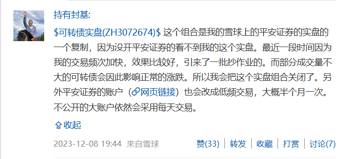
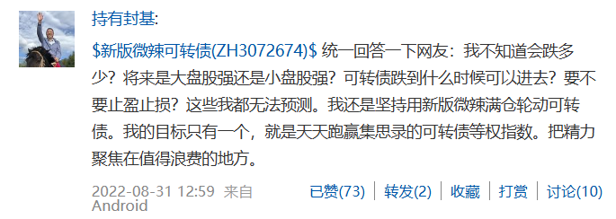
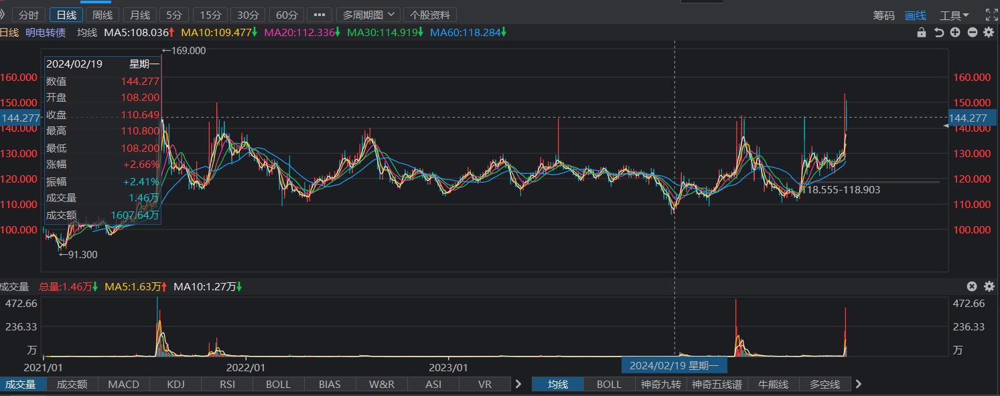
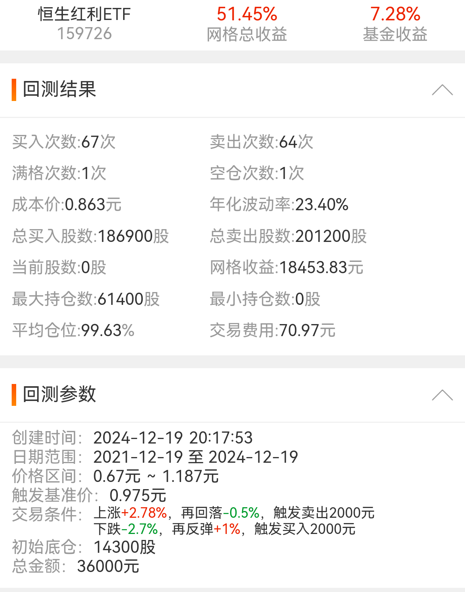
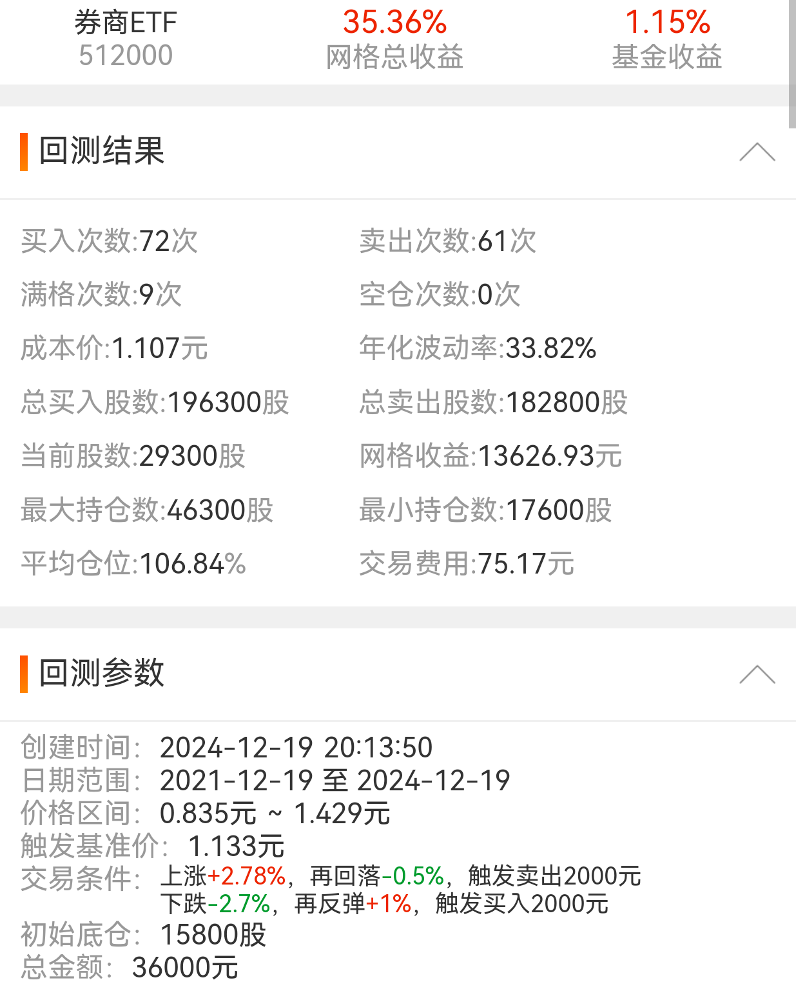

在这里规划与记录当天待办事项吧，今天是第一天~

# 计划

1. 可转债投资学习与实盘操作
1. 基金套利学习与实盘操作
1. 网格操作学习
1. 红利基金学习
1. 搜索到的投资策略分析与记录
1. 豆包AI大赛查看是否有合适的赛道参与
1. 微信小程序开发方法查询

# 总结

1. 可转债投资学习与实盘操作

可转债重新看了金老师的参考榜单的说明，还是有些收获的

> - 如果出现涨幅10%左右的脉冲，特别是正股涨幅较小的情况下，可以卖出。卖出后等几天价格回落下来再买入，或者直接买入最新名单里排名靠前而且没有持有的品种
> - 可以采用定时（一个月或者半个月）或者定排名策略。定时到点轮动，比如前20名（激进的买入扣除170元以上）轮动要求每次卖出后20名的可转债，等金额买入前20的。定排名模式要求每次卖出后50名（或者40名）后的可转，买入前20名的。一般来说，定时策略比较适合上班族的小资金，定排名策略比较时候有时间的大资金。

这两条其实是老师的个人经验，包括榜单都无私地提供给大家学习与参考。

另外看到金老师在雪球上的发言如下：

说明老师主账户还是每天交易的，为了避免跟投的踩踏，所以只公开定期轮动的了

另外老师对于一些常见问题的答复如下（这个更早了是2022年的）

没法预测，和安道全说的是一样的。所以还是要有自己的策略，老师不可能把饭做好喂到嘴里，每天给个参考榜单已经很好啦~

还是要找时间去[䘵得网](https://lude.cc)把回测搞搞清楚，一旦某天金老师不再提供参考榜单，还得继续玩下去哈。不过至少可以有双低策略，就是最近yyb凌波大佬的双低转债策略单吊一只银行股不知道是什么情况。。。

今天实盘操作主要操作了`明电转债(123087)`，开盘就下跌，比昨天做T最后买入的150元直接下跌了5、6块钱，让人有点懵。。。

请教了人了让看看会不会跌破昨天的低点（138），如果跌破就最好清仓，如果没有就可以再看看。

还真挺神奇，今天最低有低于139块过，但没有触及到138块。

下午甚至有那么一小波快速上攻快到150了。

还是胆子小，今天在140，143，145各挂了1/4仓位卖出都成交了，手里就剩下1/4仓位，成本也被降到85块了。

下午金老师群里还有人明电转债现在能不能上车。我翻了下日线如下：

发现这支转债从21年最早到现在差不多145就是顶了。。。每次上到145隔不了几天就掉下去，也不知道是不是就到这了。。。

刚才复盘看其他转债，测绘竟然也160块了，是不是有点高了明天出一些。。

2. 基金套利学习与实盘操作

新开的华宝证券加挂出了点问题，可能是一码通的问题，明天再操作下试试吧。。。

加入了猎人投资的套利群，不过这几天美股在跌可能会出现份额转到场内时净值跌幅超过溢价，从而导致亏损？

申购到转为场内这2-3天确实是风险所在，解决方案一是亏损也要卖出，回笼资金好进行下一轮套利，或者发现净值下跌则持有直到净值涨回来有利可图时再卖。

3. 网格操作学习

今天找了股市药丸（药师）的助手佐罗，重新开通了“指汇盈”的VIP，一方面可以查看佐罗提供的网格参考，一方面便于自己构造自己的网格参数与回测，虽然只能回测最近三年的数据，但也已经很棒了。

[相关工具与学习资料](../../investment/量化交易/网格交易.md])

做了几组红利与券商的回测，最好的结果如下：

恒生红利ETF：

 

券商ETF：

 

当然，过往盈利并不代表未来一定会盈利，还需要再多测试参数和分析下佐罗现有网格的参数，再优化优化，然后小量实盘操作一下~

今天差不多就到这里了，其余的计划都没有时间看了~贪多嚼不烂~