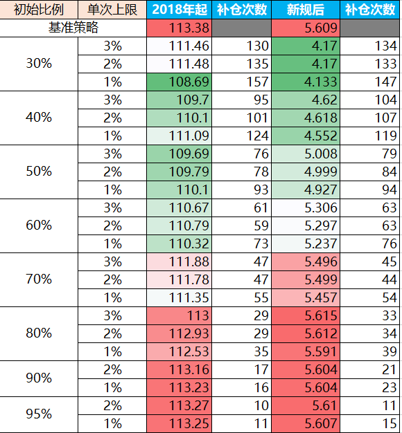

# 可转债是满仓轮动好还是部分仓位轮动下跌时补仓收益高？

先说当前结论：满仓干不要怂。

觉得结论没问题的家人们可以退出浏览了~ :P

这个结论如何得出来的呢，我下面给出回测方法与回测结果。

另外先打两个预防针：
1、只做了一组回测，不排除结果不具有普遍性的可能性；
2、做的是回测，未来是否也能如此也不好说。

如果你说我说的不对，那你是对的 :)

好下面进入正文。

之所以想做这个事是因为最近搞了一个新的可转债轮动策略，感觉风险有点大，于是先小仓位上，试运行了一段时间后，觉得实盘与回测差距不大，在想如何把仓位加上来呢，从高抛低吸的想法来说肯定是下跌时补仓更划算嘛~于是就每天轮动前看看当前的涨跌情况，来决定是不是加点仓位进来。

结果嘛，肯定是有点失败，理论收益还有4个多点，实盘已经亏损了。。。主要原因就是部分上涨时仓位小实际收益不多，部分下跌时仓位上来了实际损失会更多。。。

其实群里也时常有讨论转债轮动是否需要择时。很久之前我也做过类似的回测，使用的是根据转债中位数或温度进行仓位控制，结论是不如一直满仓干收益高。不过之前的回测结果找不到了，另外每天轮动前检查当天的转债中位数或温度也过于麻烦了。于是重新做一个回测吧。

步骤如下：
1、选择一个基准策略，在䘵得网1.0（不知道的请百度，下次有空再做2.0，提前觉得结论不会有变化）获得从2018年起的日收益数据
2、根据日收益数据制作基准策略的净值，假设初始资金为1，则第N天的净值为 N-1天净值*(1+N天收益率)。
3、设置两个新的回测净值，一个2018年1月2日起，一个新规2022年8月1日起，在前一天的净值初始值设置为一个小于1的数值A。
4、对于新的回测净值，在第N天时首先看当天基准策略的涨跌情况，如果是上涨的，则直接N天净值=N-1天净值*（1+N天收益率）；如果当天是下跌的，则当天需要补仓，补仓的额度按当天跌幅来，但也不能是无限现金流，因此做一个限制，总体资金只有1，初始使用了A，则累计最多补仓1-A，同时每天补仓也可以有一个上限，比如总体资金的1%或2%。这里要注意，当天补仓的资金是不能进入上面的公式的，因为当天补仓的资金只是买入，并没有过多的参与当天的涨跌，主要是影响了第二天的收益。所以上面的公式要变更为： N天净值=（N-1天净值+N-1天加仓）*（1+N天收益率）。
5、对于初始资金A与每天补仓限额B两个参数进行枚举测试

回测结果如下图所示：

从图中可以看到初始比例越低，收益越低，但其实也没差多少。补仓的次数从11次到157次分布。

所以结论就很简单，策略没有大的问题，满仓干就完了，先投入部分资金，后面碰到下跌再补仓，一个是麻烦每天要盯盘，另外就是收益也并没有超额，何苦来呢？

