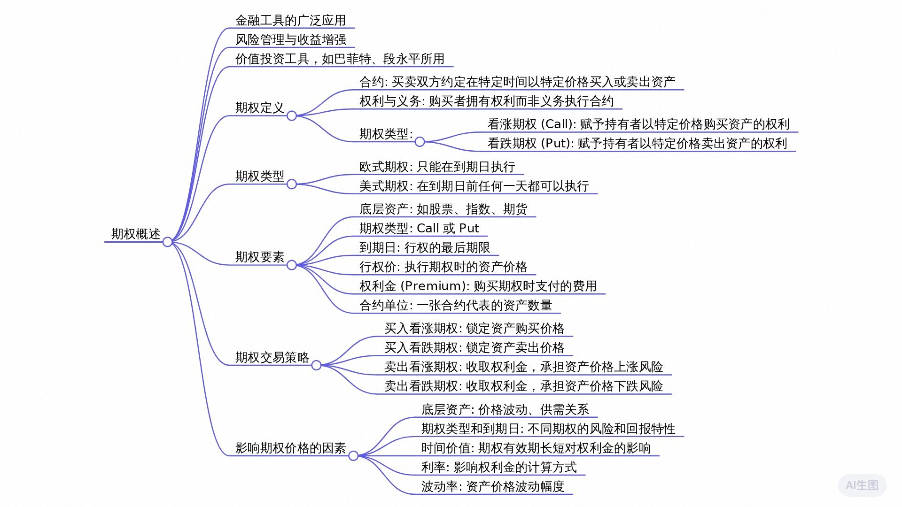
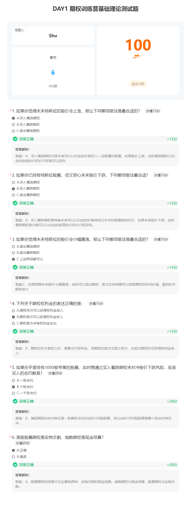

# 老虎期权训练营DAY1 学习笔记

## 2024年12月11日 

[通义分析（含录音）](https://lxblog.com/efficiency/U/ByuN0oUNuXCBJkY6TBlTMIXdBLzgIQx7)

### 思维导图

### 课程内容摘要

首先介绍了期权的基本概念及其在金融市场中的关键作用，通过生动的“胖虎”比喻，深入浅出地说明了期权买卖双方的权利与义务。期权分为看涨和看跌两种，分别赋予持有者在未来以特定价格买入或卖出资产的权利。他详细阐述了期权的六大核心要素：即底层资产、期权类型、到期日、行权价格、权利金以及合约单位，并对比了作为期权买方和卖方的不同交易策略。他特别强调，期权交易不仅是风险管理的有效工具，还能增强投资收益并助力市场价格发现，同时指出期权权利金的价格受市场预期、时间价值等多种因素影响。最后，他预告了下一节课将深入探讨期权价格的计算方法及其影响因素，为听众提供了丰富的学习方向。

### 要点回顾

#### 期权是什么？
> 期权是一种金融工具，它赋予购买者在未来特定时间以约定价格买入或卖出特定资产的权利，是买卖双方达成的一项合约。

#### 期权合约中的买卖双方具体约定的是什么内容？
> 期权合约中买卖双方约定在未来某个特定时间或已约定好的价格买入或卖出某个资产，例如股票、指数、期货等。

#### 看涨期权和看跌期权分别是什么？
> 看涨期权（认购期权）允许持有者在行使权利时以约定价格买入标的资产；看跌期权（认沽期权）则赋予持有者在约定时间内以约定价格卖出标的资产。

#### 期权卖方的角色和义务是什么？
> 期权卖方承担提供保险义务的责任，当买方行使期权时需要按约定执行交易。作为交换，卖方收取买方支付的权利金，类似于收取保费。

#### 期权权利金的价格和走势受哪些因素影响？期权的定价依据是什么？
> 期权权利金的价格和走势主要受底层资产、期权类型（call或put）、到期日、行权价、权利金和合约单位这六大要素的影响。期权的定价基于对底层资产未来表现的预期，同时考虑了期权类型、到期日等因素，并且类似保险机制，通过计算事故发生概率来确定保费（即权利金）。

### 大模型问答学习

**问：** 对于期权来说，存在四种操作类型，买CALL，买PUT，卖CALL，卖PUT，我只能对买的部分理解，对于卖的部分不是很理解，请帮我解释下卖CALL和卖PUT是什么意思，他们是和买CALL与买PUT互为对手盘吗？

> 卖出期权（卖CALL或卖PUT）意味着你作为卖方同意根据期权合约的条款，在未来某个时间以约定的价格（执行价格或行权价格）买入（对于卖PUT）或卖出（对于卖CALL）一定数量的标的资产。当你卖出期权时，你会收到期权费（premium），这是买方为了获得这份权利而支付给你的费用。

> 以下是更详细的解释：

>**卖出CALL期权（卖CALL）**

>当你卖出一个CALL期权，你是在向买方承诺，如果买方选择行使这个期权，你将按照事先确定的执行价格卖出一定数量的标的资产。如果在期权到期时，市场价格高于执行价格，那么买方可能会行使期权，要求你以较低的执行价格卖出资产，此时你可能需要在市场上以更高的价格购买这些资产来履行义务，因此可能会产生亏损。如果市场价格低于或等于执行价格，买方通常不会行使期权，因为你持有的资产价值并没有超过市场价，这时你就可以保留收到的期权费作为收益。

> **卖出PUT期权（卖PUT）**

>当你卖出一个PUT期权，你是在向买方承诺，如果买方选择行使这个期权，你将按照事先确定的执行价格买入一定数量的标的资产。如果在期权到期时，市场价格低于执行价格，那么买方可能会行使期权，要求你以较高的执行价格买入资产，这可能导致你以高于市场的价格购入资产，造成潜在的亏损。如果市场价格高于或等于执行价格，买方通常不会行使期权，你可以保留收到的期权费作为收益。

> **互为对手盘**

>是的，卖出和买入操作确实是互为对手盘的关系。例如，当一方买入CALL期权时，必须有另一方卖出相应的CALL期权；同样地，当一方买入PUT期权时，也必须有另一方卖出相应的PUT期权。每一笔交易都有两个参与者：一个买家和一个卖家。在期权市场中，买家支付期权费以获取权利，而卖家收取期权费并承担相应的义务。

**问：** 对于个人投资者来说，是不是经常使用到买CALL或PUT的操作，会涉及到卖CALL或PUT的操作吗？这四种操作都是什么情况下做出来的，为什么有人买的同时会有人卖出CALL或PUT呢？

> 对于个人投资者来说，买CALL或PUT的操作确实更为常见，因为这些操作相对简单，风险也更易于理解。买入期权（无论是CALL还是PUT）是一种有限损失、无限收益（CALL）或有限收益（PUT）的投资方式，适合那些希望对市场方向进行投机或者保护现有投资组合的投资者。

> **何时使用这四种操作**

> **买CALL：** 当你预期某只股票的价格会上涨时，你可以购买CALL期权，这样你就有权利在未来以一个固定价格买入这只股票。如果股价真的上涨了，你可以行使这个权利，以低于市场的价格买入股票，然后在市场上卖出赚取差价；或者你可以直接在期权市场上卖出这个看涨期权来获利。如果股价没有如你所愿上涨，你的最大损失是支付的期权费。

> **买PUT：** 如果你认为某只股票的价格会下跌，或者你持有这只股票并担心其价格下跌，你可以购买PUT期权。这样你就有权利在未来以一个固定价格卖出这只股票。如果股价下跌，你可以行使这个权利，以高于市场的价格卖出股票，减少损失；或者你可以卖出这个看跌期权来锁定利润。如果股价没有下跌，你的最大损失同样是支付的期权费。

> **卖CALL：** 当个人投资者持有某只股票并且相信它的价格不会大幅上涨，或者他们愿意在某个更高的价格卖出股票时，可能会选择卖出CALL期权。通过卖出CALL，投资者可以收取期权费作为额外收入。如果股票价格上涨超过了执行价格，投资者可能会被要求按照执行价格卖出股票，但这正好符合他们原本就打算在该价位卖出的意愿。如果股票价格保持不变或下跌，投资者保留了股票，并且赚取了期权费。

> **卖PUT：** 当个人投资者想要以更低的价格买入某只股票，并且有足够的资金准备在需要时买入时，他们可能会选择卖出PUT期权。通过卖出PUT，投资者同样可以获得期权费作为额外收入。如果股票价格下跌到执行价格以下，投资者将被要求以执行价格买入股票，但这也是他们原本就想做的事情。如果股票价格维持在执行价格之上，投资者则保留了期权费，并且不需要买入股票。

> **为什么有人买的同时会有人卖出CALL或PUT？**

> 每次期权交易中，必须有一方买入而另一方卖出，这是由于期权合约本质上是双边协议。买家支付期权费获得权利，卖家收取期权费承担义务。因此，每笔期权交易都涉及到一个买家和一个卖家。以下是几种常见的动机：

> **风险偏好不同：** 一些投资者可能更倾向于保守的投资策略，希望通过买入期权来限制潜在的损失或锁定未来的买入/卖出价格；而其他投资者可能更愿意承担一定的风险，通过卖出期权来获取额外的收入。

> **市场观点不同：** 不同的投资者对同一资产的未来表现有不同的看法。比如，一些投资者可能认为股票价格会上涨，所以他们会买入CALL；而另一些投资者可能认为股票价格不会涨那么多，甚至可能下跌，所以他们会卖出CALL来赚取期权费。

> **对冲需求：** 机构投资者和个人投资者都可能使用期权来进行风险管理。例如，持有大量股票的投资者可能会买入PUT期权来保护自己免受股价下跌的风险；而他们也可能卖出CALL期权来增加收入，同时接受在股价上涨时可能需要卖出股票的风险。

> **套利机会：** 专业交易者可能会寻找市场中的套利机会，利用期权和其他金融工具之间的价格差异来获利。这通常涉及复杂的交易策略，包括同时买入和卖出多个期权合约。

> 综上所述，买卖CALL和PUT的选择取决于个人投资者的风险承受能力、市场预测、投资目标以及是否已经持有相关资产。每个人的投资决策都是基于自己的情况和市场分析做出的，因此即使是对同一个标的资产，也会有投资者选择买入，也有投资者选择卖出。

### 课后打卡

### 课程听记原文

大家好，欢迎来到老虎机学小课堂。作为一种被广泛使用的金融工具，期权的市场价值早已在全世界范围内得到认可。巴菲特、段永平这样的价值投资大佬也喜欢交易期权，因为期权既是风险管理工具，也可以作为收益增强和价格发现的工具。用好期权这把利刃，让你赚钱的方式更加的丰富立体。那么期权到底是什么呢？现在就跟我学习，如果有个人，我们就叫他胖虎。

胖虎跟你说，我允许你30天之内可以使用1200美元一股的价格跟我买100股特斯拉。前提是你现在就得给我100美元，如果到时候你不想买了，这100美元也不能退，你会怎么想？

首先当然是查一下现在特斯拉的股价是多少，然后评估一下30天内特斯拉股价会不会超过1200美元。如果你觉得没问题，那你支付了100美元，你跟胖虎之间就成立了一个合约。这个合约就是期权合约。你父亲买了一项权利，胖虎收钱承担相应的义务。

到这里我们就理解什么是期权了。七代表未来的一个时间期限权，代表权利。期权是买卖双方达成的一项合约，这张合约具体代表什么呢？期权的买卖双方约定好在未来的某个特定时间或是这个时间已约定好的价格买入或卖出某个资产。

这个资产可以是股票，可以是指数，可以是期货。刚刚你从胖虎手里买的期权，叫看涨期权或认购期权，也就是靠为什么靠是看涨呢？因为当你行使权利的时候，你就从他的手里偷走了。股买入看涨期权，可以提前锁定价格去预购看好的资产。

反过来，有一天泡沫跟你说，我最近看特斯拉涨得很高了，你要不这样给我100美元，30天内你可以随时以8万美元一股的价格卖给我100股特斯拉，你干不干呢？如果你很早就买了100股，特斯拉，成本在六百多，现在涨价到1000多了，你担心后续会暴跌，那很可能就干了。

跟高相反，你买到的是把股票卖给对方的权利。所谓的破产，就叫做看跌期权或者认沽期权，也就是把你的股票破得到对方的桌上了。这个命名是不是很科学呢？前面说完期权的概念和类型，总结起来就是我们如果看好一项资产的走势，可以花一笔钱提前锁定它的买入价格，也就是买入扣。

反正如果我们觉得资产价格会下行，也可以花一笔钱锁定卖出价格，也就是买入库存，到这里还都十分简单。问题出现了，胖虎为什么要卖给你？胖虎是谁？呀？其实就是跟你一样的，投资者直觉告诉我们，我们没法卖出自己没有的东西，但是期权却不是这样的。

你可以买call买put也可以去卖，call my也称之为short call或者叫short post. 

当你做期权卖方的时候，你的角色就跟前面的反过来，也就是胖虎的角色了。其实买方拥有权利，而你作为期权卖方也是要承担相应义务的。作为承担义务的代价，你可以收到来自买方付出的期权权利金。全明星跟行权价不是一回事，它更像是保费的概念。你收了保费，可以为别人提供保险义务。

我们知道保险公司通常都是赚钱的，因为事故发生的概率都算入到保费里了，期权的定价也是如此。这也就是为什么专业的机构和投资者更愿意做期权的卖方了。在判断对的前提之下，贷方往往能够获得持续的收入。

买卖和靠谱的组合一下，就是四种情形，觉得股票要大涨，以小博大的买高，觉得股票不会大涨。比如下跌震荡小涨的人，卖空赚钱，定金，觉得股票会大跌的人买破的也是以小博大。随着股票不会大跌，比如上涨，震荡，小跌的人卖货的准确率低。

总结一下，这节课我们学习了数学的概念和用途，以及一个重要的点。我们可以作为期权的买方，也可以作为期权的卖方，买卖双方的权利义务。相反，对市场的判断也相反，这份全面的价格就是期权的定价，也就是权利金是不断变化的。你所听过的期权赚十倍百倍的故事，指的就是权利金翻十倍百倍。那么什么因素会影响期权权利金的价格和走势呢？

首先第一个要素就是期权的底层资产。大家知道期权是个合约，所谓底层资产就是具体是关于什么东西的合约。你买特斯拉苹果的个股期权，那特斯拉苹果的股票就是对应期权的底层资产。

期权走势跟正股表现紧密相连，底层资产除了股票以外，还包括指数、etf、期货等等。第二个要素是期权类型，就是call和put看涨和看跌期权。第三个要素是到期日，也是股票和期权最大的不同之一。

股票你可以一直拿到天荒地老，期权却不行。过了约定时间就是废纸一张。那么期权是不是一定要到到期日才能行权呢？答案取决于期权类型是美式期权还是欧式期权。美式期权在到期日之前任意一天或当天都可以行权。欧式期权则必须在到期日当天才可以行权。我们平时交易的大多数股票期权属于美式期权，而指数期权通常指的是欧式期权。

巴菲特就曾经卖出指数的长期看跌期权，为什么呢？就是因为指数的期权是欧式期权，他不用担心，因为短期的波动就被行权了。另外，美股标的大多有州权和跃权，港股标的一般只有越权。美国的越权是每个月第三周到期的期权。港股的月权一般是月底到期，相对来说美股标的的期权更多，流动性和成交量较大，其中知名公司的期权是大家主要交易的对象，比如特斯拉、苹果等。

太远期货知名度更高的公司的稀缺，基本上没有什么流动性最好避开行权价和权利金，是新手容易混淆的两个概念。实际身价就约定买入或卖出的底层资产价格权。

利金的概念也讲过，划重点期权买卖双方之间交易的不是股票，而是合约。每张合约都有自己独立的行情走势，它是基于底层资产衍生出来的，所以我们才叫它衍生品。

一只股票期权合约可以有无数张，每张的权利金都是在变动中的第六个要素，合约单位就是一张合约对应的资产数量，每股期权一张合约约定155亿张，特斯拉期权合约对应100股特斯拉股票，港股期权对应关系不固定。比如，美团股票期权一张就对应500股。

交易的时候要看清楚对应的数量，是，不然很可能一不小心就买多了。

注意汽车行情里显示的权利金是一股的价格，如果你买卖一张或者说一手实际的成交金额是要一股价格乘以合约单位的每股期权就是乘以100千万。别以为自己要买100股的机器人，就在下单的时候输入了一个100，最后给大家来展示一下期权链。

怎么看期权链有两种形式列表，报价和梯形报价，APP内可以设置那个报价，就是这样选不同的到期日，左滑就可以看到全部特定行程下的各类指标和价格上下滑，就可以看到不同行权价对应的合约。梯形报价是这样，上方切换到期日，中间是行权价，左右两边分别是call和put，他们的成交价，就是权利金。

OK, 今天的课程我们总结了期权合约的六大要素，分别是底层资产、期权类型、到期日、行权价权利金和合约单位。我们也知道期权买方要付钱给卖方来获得期权，那么这个期权究竟值多少钱？为什么一只股票不同的期权费用差别那么大？

下一节课我们接着聊。
