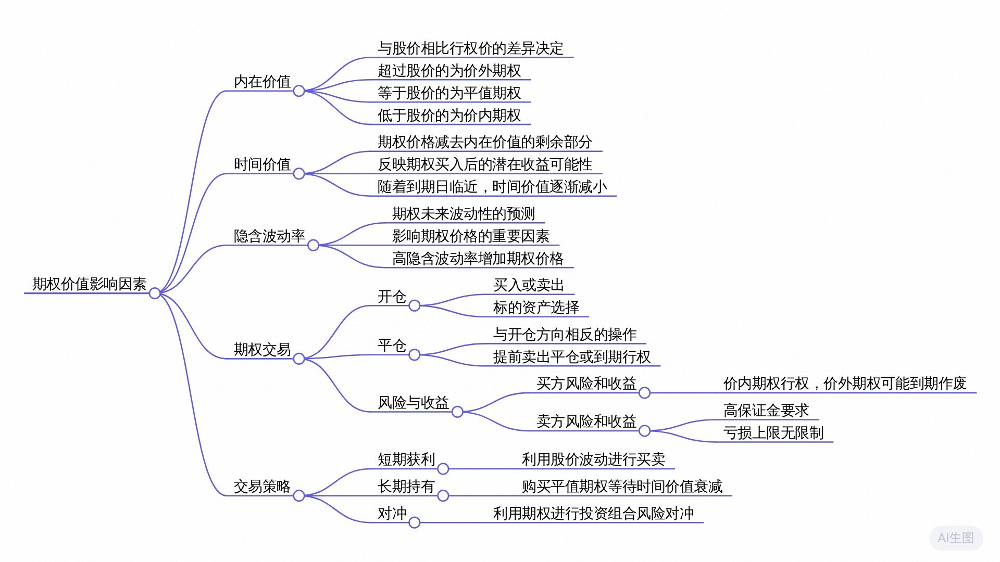
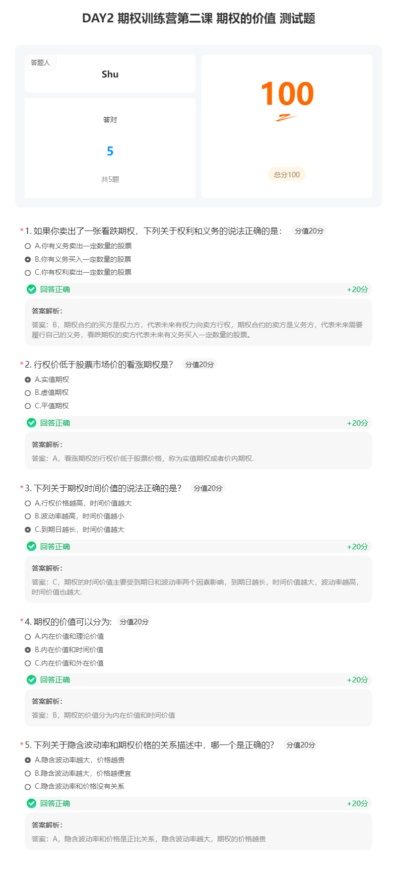

# 老虎期权训练营DAY2 学习笔记

## 2024年12月12日 

[通义分析（含录音）](https://lxblog.com/efficiency/U/7WVDp36J68TvTNPA529kQDTQ0lL3UrnZ)

### 思维导图

### 课程内容摘要

本次课程深入探讨了期权合约的核心要素，包括标的资产、行权价、到期日和隐含波动率等，以及期权价值受标的资产价格变动、行权价、时间价值和市场波动率等因素的影响。通过特斯拉期权链的案例，详细解释了期权的内在价值和时间价值，进一步说明了期权价格的决定因素。讨论了期权的买入与卖出策略，涵盖了平仓、行权和到期处理等操作，并对比了期权买卖双方所面临的风险与收益。最后，演示了使用Tiger Trade进行期权交易的实际操作流程，从选择合约到下单，再到注意事项，为读者提供了实践指导。整个讨论强调了理解期权市场动态与规则的重要性，帮助投资者做出更加明智的交易决策。

### 要点回顾

#### 股票价值最终取决于什么因素？
> 股票价值最终取决于公司的盈利能力。

#### 影响期权价值的因素有哪些？
> 影响期权价值的因素包括资产、期权类型、到期日、行权价、权利金和合约单位等。其中，股价与行权价的关系对于区分价内外期权至关重要，同时，内在价值和时间价值也是影响期权价格的重要组成部分。

#### 什么是价内外期权？
> 价内期权是指行权价低于股价的期权，也称为实质期权；价外期权则是指行权价高于股价的虚值期权。当期权价等于股价时，称为平值期权。

#### 时间价值是如何定义的？
> 时间价值是期权的价格减去内在价值后的金额，它反映了期权买入后带来收益的可能性，通常随着到期日的临近和市场波动性的增加而增加。

#### 隐含波动率对期权价格有何影响？
> 隐含波动率是对期权未来一段时间内波动的预测，IV（隐含波动率）越高，期权价格越贵。例如，特斯拉的隐含波动率通常高于标普500指数ETF，因此同等条件下，特斯拉的看涨期权可能更贵。

#### 期权的买卖方式和收益风险如何？
> 买卖期权可通过买入、卖出和平仓三种交易方式操作。开仓后，可以通过提前平仓、持有到期行权或卖出等方式进行交易。买方收益与风险并存，卖方同样面临风险，但有时卖方的风险和收益结构可能更有利于抓住短期市场波动的机会。

### 大模型问答学习

**问：** 股票期权交易中卖CALL的操作是需要保证金的，如果判断错误股票不断上涨，则所需要的保证金也跟随上涨，一旦保证金不足可能会被强制平仓，那么请问如果这种情况下被强制平仓，是否会影响到对手盘呢，也被强制平仓了吗，还是有谁来替代被强制平仓的卖CALL玩家来继续做买CALL玩家的对手盘？

> 在股票期权交易中，当卖CALL方被强制平仓时，并不会直接影响到买CALL方或导致买CALL方也被强制平仓。期权市场有一个中央清算机构（通常称为清算所或结算所），它作为所有交易的对手方，确保了即使一方无法履行合约义务，另一方的权益仍然能够得到保障。

> **强制平仓的影响**

> **对卖CALL方的影响：**

> 如果卖CALL方保证金不足且未能及时补充，交易所或其经纪商有权对该仓位进行强制平仓。
>强制平仓意味着卖CALL方的仓位将被关闭，以防止进一步的损失。这通常涉及到在市场上买入相应的CALL期权来抵消原有的卖出仓位，从而解除卖方的义务。

> **对买CALL方的影响：**

> 买CALL方的权利不受影响。即使卖CALL方被强制平仓，买CALL方仍然持有有效的CALL期权，可以按照合约条款行使权利或将其出售。
> 中央清算机构会介入，确保买CALL方的权益不受损害。如果卖CALL方无法履行义务，清算机构将承担起卖方的角色，继续作为买CALL方的对手盘。

> **清算机构的作用：**

>清算机构通过收取买卖双方的保证金来降低违约风险。对于卖CALL方，保证金是用于保证其履行义务的资金；对于买CALL方，虽然不需要缴纳保证金，但支付的期权费也起到了类似的作用。
>当卖CALL方被强制平仓时，清算机构会使用卖方的保证金来覆盖任何可能的亏损。如果保证金不足以覆盖这些亏损，清算机构本身会承担这部分风险，确保市场的正常运作和买方的权益。

> **替代卖方：**

> 在实践中，清算机构不会直接成为永久的卖方，而是通过市场操作（如再卖出新的期权合约）找到新的卖方来接替原来卖CALL方的位置。这样可以保持市场的流动性，并确保每个期权都有一个活跃的对手方。

> **总结**

》 总之，在期权市场中，由于有中央清算机构的存在，卖CALL方被强制平仓不会直接影响买CALL方，也不会导致买CALL方被强制平仓。清算机构会确保买CALL方的权益得到保护，并通过市场机制找到新的卖方来继续作为买CALL方的对手盘。这种机制有助于维护市场的稳定性和可靠性。

**问：** 对于看涨的行情可以买CALL或者卖PUT都能够起到赢利的作用吗？这种情况下这两种操作有什么区别，从风险和收益等情况来看？

> 在看涨的市场行情中，买CALL和卖PUT都可以作为投资策略来利用预期的价格上涨获利，但两者在风险、收益潜力以及操作细节上存在显著差异。下面我们将详细比较这两种策略：

> **买CALL（买入看涨期权）**

> **成本：** 需要支付期权费（premium），这是购买期权的权利金。

> **收益潜力：理论上无限。**

> 如果股票价格大幅上涨，期权的价值也会相应增加，投资者可以通过行使期权或在市场上卖出期权来获得高额利润。

> **最大损失：有限。** 

> 最坏的情况下，即股价没有上涨或下跌，投资者的最大损失是支付的期权费。

> **权利与义务：** 买CALL赋予持有人在未来某个时间以约定价格买入股票的权利，但不是义务。这意味着你可以选择不行使期权，只承担期权费的损失。

> **适用场景：** 当你非常看好某只股票未来的表现，并且愿意为这种潜在的高回报支付一定的前期费用时，买CALL是一个合适的选择。
卖PUT（卖出看跌期权）

> **收入：收取期权费（premium），** 这是卖方从买方那里得到的权利金。

> **收益潜力：有限。** 最大收益是所收取的期权费。如果股价在期权到期时高于执行价格，期权将不会被执行，卖方可以保留期权费。

> **最大损失：理论上无限。** 如果股价大幅下跌，卖方可能被迫以高于市场价格的执行价格买入股票，导致亏损。不过，由于你是在看涨市场中使用这个策略，这种情形发生的概率较低。

> **权利与义务：卖PUT意味着卖方有义务在期权被行使时以约定价格买入股票。** 如果股价低于执行价格，买方可能会行使期权，要求卖方以较高价格买入股票。

> **适用场景：** 如果你已经看好某只股票并且有意在特定价位买入它，卖PUT可以作为一种降低买入成本的方式。此外，它也可以用来产生额外的收入，特别是当市场相对稳定或略有上涨时。

> **风险与收益的比较**

> **风险对比：**

> 买CALL的风险是有限的，因为最大损失仅限于支付的期权费。

> 卖PUT的风险是有限的，但在极端情况下（如股价大幅下跌）可能导致较大的损失，尽管这种情况在看涨市场中较为少见。因此，卖PUT更适合那些有足够资金准备应对潜在买入需求的投资者。

> **收益对比：**

> 买CALL的收益潜力是无限的，随着股价上涨，期权价值也可能大幅增加。

> 卖PUT的收益是有限的，最大收益为所收取的期权费。然而，如果股价上涨超过执行价格，卖方可以保留期权费并避免购入股票。

> **资本效率：**

> 买CALL通常需要较少的初始资本，因为它只需要支付期权费。

> 卖PUT可能需要更多的资本，因为卖方必须准备好在期权被执行时买入股票的资金，这通常涉及到保证金要求。

> **总结**

> 买CALL适合那些希望从股价上涨中获得无限收益，并且能够接受有限损失的投资者。它是一种更为保守和灵活的选择，尤其适用于对市场趋势有强烈信心的投资者。

> 卖PUT适合那些有意在特定价位买入股票，并希望通过收取期权费来降低买入成本的投资者。它也是一种产生额外收入的方法，但在看涨市场中使用时需要谨慎管理风险，确保有足够的资金来履行可能的买入义务。
选择哪种策略取决于个人的投资目标、风险承受能力和市场观点。每种策略都有其独特的优势和挑战，投资者应该根据自己的情况做出最合适的选择。

### 课后打卡

### 课程听记原文

上节课我们介绍了期权合约的六大要素组成，资产、期权类型、到期日、行权价权利金和合约单位。我们通常说股票价值最终取决于公司的盈利能力。你说这个取决于什么呢？

这节课我们就聊一聊影响期权价值的因素。一起来看看特斯拉的期权链。目前特斯拉股价为958.5亿美元，可以看出同样是看涨期权，靠同一个到期日，不同行权价的权利金差异很大。是什么原因呢？我们往左滑可以看到这一列内在价值和时间价值。这两个数字有什么特点呢？加在一起就等于前面的最新价格中间这条线是什么？

对于涛来说，线上面的就是价内，期权线下面的就是价外期权如何区别价内外呢？其实就是看行权价和股价的哪个高哪个低。期权价高于股价的就叫做价外，期权又叫做虚值。期权行权价低于股价的又叫做价内期权又叫做实质期权。

如果期权价刚好等于股价，就叫做平值期权，或者则相反，线上方是价位齐全，下方是价位齐全。现在我们再来看内在价值和时间价值，这两列我们就会发现，无论是call还是put，价格，齐全，都有内在价值。内在价值其实就是现在立即行权得到的价值，价外期权的都没有内在价值，只有时间价值的。其实这里我们就可以看出来，价内价外期权都是可以随时切换的。

唯一的因素就是当前股价时间价值是什么意思？实际上时间价值并没有什么严格的定义，它本来就是用期权的价格减去内在价值算出来的一个金额。它反映的是期权买入后带来收益的可能性，到期日越远，加上波动的可能性越大，时间价值也就越高。

当期权合约到期时，时间价值归零，这就意味着价位期权变得一文不值。当你买入一张期权，它的时间价值就是在不断衰减的。就像冰块在太阳底下融化，越往后融化的越快。

距离到期日一个月的时候是一个临界点，一个月内到期的期权时间价值衰减的会比前面快很多。到现在我们就能够从技术链上发现一个简单而且符合直觉的规律。

对于call来说，股价上涨，call就上涨，行情价越高，call的价格越低。

对于pod来说，股价下跌pot就上涨，行情价越低，pot的价格就越低，无论是call还是put，距离到期日越远，价格就越高。

现在我们再用直觉来猜测一下，标普500指数ETF的期权和特斯拉的期权里，在相同到期日行权价都约等于股价的看涨期权。哪个更贵呢？答案当然是特斯拉了，因为它的波动明显，比标普五百波动大得多。这就要介绍到影响期权价格的一个非常重要的因素，隐含波动率可以理解为对期权未来一段时间内波动的预测，波动方向可上可下，期权IV越高，价格越贵。

在期权链上我们可以看到IV的数值。我们可以看出特斯拉IV是58.79%，而SPY的ID只有15.23%，隐含波动率是用公式算出来的。如果某个期权合约的价格代入之后算出来的隐含波动率比历史IV高很多，因为买的人多了，把价格推高了。

通常来说，公司财报发布前，无论是扣还是不扣，隐含波动率都会升高。而发布财报后，尘埃落定，期权的隐含波动率又会降下来。如果我们是买方，看到隐含波动率变高就得小心了。如果我们是卖方，则可能会发现套利的机会。

那么，期权究竟如何交易，买卖双方的收益和风险是什么？接下来我们用tiger trade来展示实际操作的关键步骤和注意事项。和买股票一样，你也要首先确定一个期权标的，进入期权列之后，选择一个合约进入到详情。这时候你就可以看到下单有买入、卖出和平仓三种交易选项。

当你手里没有这个期权的时候，你只能买入或卖出两种方向，都叫做开仓。当你有了仓位之后，就可以选择平仓。平仓就是跟你原来的仓位相反的操作。如果你持有的多头平仓就是卖出。如果你持有空头平仓就是买入。一般来说开仓买入一张期权后，大致会有三种操作方式。第一种是到期日来临之前提前卖出平仓。假设特斯拉10月1号股价是1000美元一股。

胖虎很看好后续走，走势，于是买入一张特斯拉。12月31号新询价1100美元的高，总共花了1000美元。期间，特斯拉股价果然一直上涨高，也跟着上涨。

.

12月1号，特斯拉股价已经是1060美元，虽然股价才涨了6%，但是胖虎发现靠收益率已经达到了100%，也就是说买入时价值1000美元的期权，这个时候已经价值2000美元，员距离到期日还有30天。胖虎决定落袋为安，于是他直接点平仓卖出高不考虑手续费，收益率就是百分之百。当然，这是判断对了的情况。

如果12月1号特斯拉股价没怎么涨，这种靠亏掉500美元也是有可能的，因为时间价值是在损耗，这时候他同样可以选择平仓来止损。

第二种方式就是持有到期还是靠谱的例子但是到了12月31号，特斯拉股价涨到1200美元，选择行权以1100美元买入一手特斯拉。

这意味着泡芙至少需要11万美元的保证金，净收益等于1200，减去1100美元，再乘以100，再减去期权本金的1000美元，也就是9000不考虑手续费，收益率高达9%。如果胖虎保证金不够怎么办？券商会在行权日当天收盘前几个小时扫描账户，如果发现保证金不够，行权，就会直接把期权按照市场价平仓。

这时候的市场价可能不是最优价格，因此如果保证金不够，建议大家自己主动挂单平仓，以争取满意的价格。还有另一种可能，券商帮你行权后，第二个交易日把部分股票持仓强行平仓。为什么会这样呢？因为美股的个股期权是实物交割，前面说过期权，除了个股期权，还有指数期权。指数期权就是可以用现金进行交割。

比如说如果交易的是标普500指数期权，按照刚刚的那种算法，胖虎就赚了9000美刀。胖虎的账户里就直接多出来9000美刀的现金，不需要真正的买入指数，也就不需要账户有对应的保证金。如何计算行权所需的资金呢？可以参考对应个股的保证金要求比例，如果正股的保证金要求是30%，就按照现价乘以30%形成数量，看看自己账户的可用资金是否满足。

当然，这些都是到期后价内期权的处理方式，对于到期后的加班期权，一般来说只有一种结果灰飞烟灭。12月31号，如果特斯拉股价没有涨到1100美元，作为买方，肯定不会选择行权，那么1000美元买入的这张卡就会在第二天从账户持仓里消失。这里或许有人就会好奇，价位期权有没有可能就非要侵权呢？

其实是有可能的。如果买家本来就想大量买入底层资产，而当下流动性一般直接买多了，可能会把价格推高，从而把买入成本也拉高。这个时候如果你手里的期权是轻度价外的行权，反而可能降低总成本。上面讲了这么多，都属于买入开仓的情况。

而我们从第一节课就告诉大家，期权卖方的风险和收益也要了解和掌握。因为很多情况下卖方胜率是更高的。

接下来用tiger trade APP来展示一下期权的卖出操作。

10月1号，胖虎选择了卖出，开仓一张。

12月31号行程价1100美元的call，首先他收入了1000美元的权利金，这意味着他不看涨。

在到期日之前，特斯拉股价下跌，这1000美元的权利金就是他最高的收入。

12月1号，假设特斯拉股价下跌到900美元，这时候炮火卖出的高，从价值1000美元可能变成了200美元。这时候，虽然距离到期日还有一个月，但胖虎1000美元的收益已经实现了80%，怎么算的呢？1000减200再除以1000，也就是80%。

胖虎想的是，再等一个月到期，就算卖出的靠完全作废，最多只能再赚200的人。这里还要面临特斯拉股价突然暴涨的风险，不如就买入平仓，落袋为安。如果选择持有到期呢，显然如果到期时卖出的高变成了价格期权，胖虎就必须履行义务，以1100美元的价格卖出100股特斯拉股票。如果卖的不是靠，而是put呢，那就必须按照行权价买入股票。

当然，最理想的是卖出的期权还是价外期权。那么卖出的期权就不会被行权。胖虎的权利金完全归自己所有，义务也就到期了。作为期权卖方到期日，如果期权没作废，那么交割方式是怎样的呢？

如果胖虎卖的是靠被行权时，他账户里又没有对应的股票可以卖出，那么他账户里的保证金会用来以行权价做空对应的股票。这里你可能不会问，万一他的账户里没有钱呢？真实情况是，当炮火要卖出靠的时候，系统就会计算他这单交易需要的保证金。保证金不足，直接就会下单失败。

随着股价的上涨，系统如果发现保证金不够了，也会要求追加保证金，不追加的话，可能一样会被券商强制停仓。如果胖虎卖的是破的，他账户里的保证金就会被用来买入对应的股票，卖空亏损没有上限。而卖put最差的情况就是买入的股票价格为零，所以亏损的上限就是行权价乘以期权持仓对应股数。小结一开仓方向包含买入和卖出。

2、期权可以选择提前平仓，也可以到期行权个股期权行权需要有足够的保证金价外期权一般到期作废。3、卖出高需要较高的保证金，亏损无上限，卖出破产的亏损是行权价减去现价，再减掉权利金，然后乘以对应股数。如果说急的情况下限价为零，那么最大的亏损就是行权价乘以对应股数，并且还要减掉赚掉的权利金。汽车通常有什么交易策略，哪些更适合你呢？

下节课我们继续聊。
