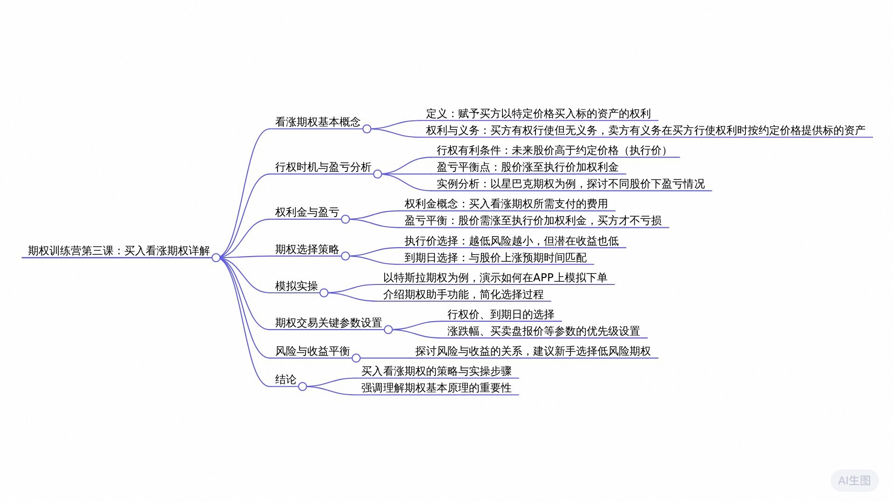

# 老虎期权训练营DAY 学习笔记

## 2024年12月13日 

[通义分析（含录音）](https://lxblog.com/efficiency/U/tNjQ9A76n7KgNr4K65hZrR8EjIr8E2n1)

### 思维导图

### 课程内容摘要

讲师在对话中首先阐述了看涨期权的基础知识，如买方的权利、行权价的定义等。随后，通过实际案例深入讲解了买入看涨期权的策略，包括行权条件、盈亏平衡点的计算，以及如何根据股价预测选择合适的行权价和到期日。强调了权利金在策略中的关键作用，并指导如何在老虎国际APP中模拟下单操作买入看涨期权。此外，介绍了期权助手功能，以简化期权选择和下单流程。整个讲解旨在帮助学员掌握买入看涨期权的策略、实际操作方法，并基于股价预测做出投资决策。

### 要点回顾

看涨期权是什么，以及作为买方的权利和义务是什么？
> 看涨期权是指买方拥有在未来特定日期以约定价格（即执行价或行权价）买入卖方手中一定数量股票的权利。如果买方选择行权，即以约定价格买入股票，那么卖方就有义务配合买方完成交易。买方有权决定是否行权，并在行权有利可图时进行操作。

什么情况下买方会决定行权？
> 当未来股价高于执行价时，买方会考虑行权，因为在行权后可以以较低的执行价购入高价股票，从而获得价差收益。例如，如果执行价为100美元，当股价涨到200美元时，买方可以通过行权赚取100美元的价差。

行权是否意味着买入看涨期权策略本身一定是盈利的？
>不一定。虽然行权时可以赚取价差，但也要扣除买入时支付的权利金成本。只有当股价上涨超过执行价加上权利金成本时，买方才真正实现盈利。例如，若权利金为200美元，股价需涨至300美元以上才能达到盈亏平衡点。

如何计算盈亏平衡点？
>盈亏平衡点是指股价需涨到什么价位时，使得买方既不赚钱也不亏损，即行权后的收益减去权利金成本等于零。例如，若执行价为100美元，且权利金为200美元，则盈亏平衡点为100 + 200 = 300美元。

实操中如何操作买入看涨期权，并举例说明？
>在实际操作中，首先需要确定买卖双方及行权条件，如买入星巴克执行价为100美元的看涨期权，买入价格为2.87美元的权利金。当未来股价大于100美元时可考虑行权；而当股价达到100美元执行价加上2.87美元权利金之和时，即102.87美元，就实现了盈亏平衡。根据股价变动，可以计算出具体的盈亏情况。

如果股价跌到90美元，为什么不行权看涨期权？
>因为一旦股价小于指定执行价（例如100美元），行权就会导致亏损，所以在此情况下，可以选择放弃行权，避免进一步的损失，仅损失权利金2.87美元。

看涨期权买方的亏损是如何确定的？
>看涨期权买方的最大亏损是固定的，即权利金的金额，比如这个案例中为2.87美元。无论股价如何变动，只要不行权，亏损就只是权利金的数额。

到期日应如何选择？行权价应该如何选择？
>到期日的选择应与对未来股价走势的预判保持一致，比如预测未来一周股价会上涨，则选择一周内到期的期权；预测一个月或更长时间后股价才会上涨，则选择相应期限内到期的期权。对于看涨期权的买方而言，执行价越低，风险越小，因为未来股价上涨的可能性更大。但同时，执行价越低，期权价格也会越高，投资成本增加，实际收益相对降低。因此，需要权衡风险与收益，新手建议选择较低执行价的期权以控制风险。

在选择期权时，如果对未来股价没有清晰预判，应如何选择执行价？如果有明确预判，比如认为星巴克股价将来会涨到100亿，这时该如何选择执行价？
>如果没有清晰的预判，建议选择较低的执行价以降低风险。即使期权权利金可能较高，但这样能保证在股价上涨时大概率能实现盈利。在这种情况下，可以考虑选择较高的执行价，因为基于较高的预判，未来有很大概率行权并获取较大利润。例如，可以选择109美元的看涨期权，虽然权利金较小，但最终盈利会更大。

买卖盘报价是什么意思？
>买卖盘报价是指在期权交易中，卖方愿意出售期权的报价。对于买入看涨期权的人来说，关注卖盘报价可以了解市场上卖家愿意以什么价格出售期权。

如果要卖出期权，应该关注哪个报价？
>如果要卖出期权，需要查看买盘报价，这是因为在卖出期权时，您会按照买盘报价来出售期权给对手方。

如何设置期权界面以方便操作？
>建议将期权界面设置为梯形展示方式，因为这种方式下，行权价、call和put一目了然，不容易操作错误。通过点击右上角设置图标，选择浏览布局并勾选“梯形”，然后返回即可。

在梯形展示界面下，如何调整参数设置以便于查看最重要的信息？
>在梯形展示界面下，将最重要的参数如买卖盘、涨跌幅等设置在靠近行权价的位置，以便快速查看和操作，减少不必要的滑动。对于不同界面可能存在的其他参数，遵循“重要参数挨着行权价”的原则进行设置。

在期权分析中，如何设置涨跌幅和买卖盘报价以接近行权价？如何模拟下单购买特斯拉的一个特定行权价的看涨期权？
>你可以通过点击设置小图标，在梯形数据项目里找到参数设置，并调整每个参数右边的小箭头进行自定义。将涨跌幅及买卖盘报价设置在最靠近行权价的位置。首先找到目标行权价（如237.5块），点击涨跌幅或其他参数以查看期权行情。在右下角找到模拟买入或卖出选项，选择买入并设定数量为一张合约。注意观察卖盘报价，并确保下单价格能够立即成交。下单后，可以在模拟交易界面查看订单状态，等待美股开盘后确认订单是否成交。

参数设置中哪些参数是最重要的，应该如何排列？
>对于小白用户来说，最常用的几个参数是涨跌幅、买卖盘报价、时间价值和内在价值，建议先将这些参数设置在最前面。隐含波动率虽然重要，但可以排在它们后面。

是否存在方便用户自动匹配所需期权的功能？
>有的，平台有一个期权助手功能，可以自动帮用户匹配所需的期权，无需手动选择到期日和行权价。只需输入股票代码，选择买卖方向（空仓或持有股票），预测股价走势以及设定期望的期权到期时间，系统便会推荐合适的投资策略和匹配的期权合约。

### 大模型问答学习

### 课后打卡

本次打卡是模拟交易截图

### 课程听记原文

00:04
Hello, 小伙伴们，大家好，欢迎来到我们的期权训练营的第三课。今天我们来讲如何买入看涨期权。首先我们来回顾一下基本概念，我们在前面的课程里面讲过什么叫做看涨期权，所以看涨期权就是说买方我们买了这个看涨期权，那你代表未来有一个权利，什么样的权利呢？我们可以以约定的价格买入卖方，他手中一定数量的一个股票。

00:31
假如说我们买了一个看涨期权，那么我们就是一个买方。代表我们买了这个call，代表，未来我们有一个权利以约定的价格。

00:41
假如说我们约定的价格是100美元，那么未来我就可以以100美元的一个价格买入这个期权的卖方，他手中的这个股票，对吧？那么这个卖方对于我们来说，它就是一个义务方。因为我们是权利方，我们如果要行使我们的权利，他就必须要配合我们履行他的一个义务。当然权利在我们手中，我们可以行权也可以不行，权我们也可以放弃，对吧？

01:07
如果说我们要行权，他就必须要配合我们，这是他的一个义务OK. 好，此时我们约定的这个100美元的一个价格，我们称为什么，行权价或者叫执行价都OK? 好，第一个问题问大家一下，既然是这样的话，我们作为一个买方，我们什么情况下会行权呢？那一定是当我们行权有利可图的时候，对吧？

01:33
假如说未来股价涨到了200美元，那你说我们会不会行权呢？当然会对吧？因为我们约定的价格是按100美元的价格买入这个股票，所以现在股价涨到200美元了。那我可以以一个非常低的价格买入一个非常贵的一个股票，对吧？当然我会行权，如果我行权，我可以直接获利100美元是吧？

01:53
以100美元的价格买入一个200美元的，直接赚到100美元的价差，对吧？好，这是第一个问题。我们什么时候会被侵权？只要未来股价大于执行，价大于形象价，我们就一定会形成。第二个问题，我们行权确实行权是会获利的对吧？股价大于执行价，我们的行权只要行权就会赚到一个价差。

02:14
那一定意味着说我们买入看涨期权这个策略本身最终是盈利的吗？有同学说了，肯定会盈利，因为你对吧？

02:24
你行权我就一个低的价格买入一个高的一个高价的一个东西，当然会盈利，但是你没有考虑一个东西叫什么权利金，你不要忘了我们买入这个看涨期权的时候，我们也花钱了。我们花的这个钱称为权利金，其实就是这个靠的一个架构，对吧？你这个还没有考虑的。好，那我假如说我们买这个看涨期权的时候，也花了200美金，那你最终你看一下你还赚钱吗？不赚了，对吧？

02:50
你本身通过行权赚了100美元的价差，但你一扣除掉我们200美元的权利，因为你最终还亏100美元，对吧？所以那怎么办呢？

03:00
所以我们才要再测算一个东西，叫做盈亏平衡点。所以盈亏平衡点就是说当股价涨到什么样的一个价位的时候，最终导致我们不赚不亏，对吧？最终是盈亏平衡的。

03:12
那你看很明显涨到200美元的时候是不行，我们净亏100美元，我们说应该涨到300美元的时候，OK涨到300美元的时候减100，刚好能赚到200美元的。然后200美元的价差再扣减200美元的一个权利金，最终告诉他一个零不赚不亏，对吧？

03:30
所以说股价涨到什么情况下，应该涨到执行价，再覆盖掉一个权利金，把这两个都给覆盖掉，最终你才是不赚不亏的对吧？所以说这里边这个300美元怎么算出来，是不是就应该是100美元的执行价，再加200美元的权利金，至少要攒到300块钱，你最终才赚不亏。如果说你涨到400的话，你就可以净赚一美元了。

03:51
整个买入看涨期权这个策略本身就是盈利100美元，对吧？

03:56
所以说买入看涨期权这个东西，这个策略我们以后要自己做的话，你首先就要考虑两个东西，一是什么时候行权，二是股价涨到什么价位的时候，我们才真正盈亏平衡。好，按照这样一个方法论，我们来实操一下。我们来看假如说我们现在要买入星巴克的一个看涨期权，那么右边我们这个期权相关的行情截图就已经给大家截出来了。

04:21
这个是来自我们的老虎国际的一个APP的一个期权行情界面。看起来可能对于新手朋友们来说，有很多东西你可能看不懂。

04:29
没关系，我们把原理讲完之后，一会儿带着大家介绍一下我们的一个期权行情界面，然后带着大家模拟下一下单，当然还是要强调一下，以上我们所有的案例全部都是基于不考虑佣金跟手续费的前提下。所以，实际情况可能相对于我们理论上会有一点偏差。好，我们来看现在星巴克的一个股票的价格是100.7美元。没关系，我们就为了这个好算，我们就假设就是100取1个整数。

04:57
好，那么假设现在我们就要买入星巴克的一个执行价为100美元的看涨期权，对吧？资金价位100美元的一个坑，其实就是我们说的平值，平值看涨期权平值的一个靠对吧？因为执行价就是等于股票的一个限价。

05:14
好，就是在这一栏起降价100，那么对应的看涨期权现在是卖盘报价2.87，买盘报价2.66，对吧？这个买卖盘报价是什么意思？一会儿我们给大家说好，我们买入这个开场之前需要花多少钱呢？需要花2.87美元的一个权利金。

05:31
其实就是这里边这个卖盘报价，这个就叫我们要买入看涨期权的一个权利金，或者其实就是看涨期权的一个价格。那现在价格是多少？我们要买就要花多少钱，为什么这个卖盘报价就是我们要买的这个价格或者权利金呢？一会儿给大家送。此时三个条件都有了。

05:51
按照我们刚刚那个逻辑，首先我们什么时候会行权条件，先说一下，什么时候会侵权，一定是未来股价大于我们的执行价的时候，对吧？你现在股价跟执行价是一样的，我们侵权就赚不到钱，但未来上涨的时候，我们就能赚到钱了。

06:07
假如说未来涨到101美元了，你说会不会侵权，一定会侵权？因为101美元大于100，我们就直接形成就能赚到1美元的一个价差，对吧？这是第一个问题，什么时候形成，只要未来股价大于100我们就行了。

06:21
好，第二个问题，什么时候当股价涨到哪个价位的时候，我们才真正盈亏平衡呢？是不是按照我们刚刚说的，股价应该等于执行价加权利金的对吧？

06:34
所以股价一定是涨到100美元的执行价，再加2.87美元的权利金，有102.87的时候，我们就真正break even了，我们已经亏平衡了。

06:46
那么这两个都搞懂之后，我再问大家第一个情况，如果说未来股价涨到101美元，那么测算一下我们买靠买入看涨期权这个策略最终盈利多少钱呢？

06:59
是不是101减100的执行价再减2.87美元的权利金，最终净亏1.87，对吧？好，这是第一个情况。第二个情况，如果说股价涨到105美元，那你最终肯定是赚钱的对吧？那就105，我减100的执行价再减2.87美元的权利金，最终净赚这个2.13美元，对吧？

07:22
那如果说股价跌到了90美元的话，有同学说的哈那不就90美元减100美元的执行价减2.87，错不应该这样，因为股价一旦小于指定价值，我们就不行权了。

07:35
这种情况下我们就不行，权对我干嘛要听他们，我们权利可以放弃，你一侵权，你还90减100，你还倒亏十块钱，我为什么会傻到用一个九，用一个100美元的一个价格去买人家一个90美元的东西呢？不会，对吧？

07:52
所以说你这种情况下不行，权，你就净亏一个2.87的一个权利金额对吧？我就放弃行为。那我相当于期权白买了，对吧？就亏2.87就行了，可不是说90减100，再减2.87，好吧，就这种情况，所以第三种情况我们不行权就直接放弃一个权利金。

08:09
所以为什么我们前面说看涨期权的买方，我们的亏损是有限，就这个道理，因为看涨期权的买方，你最终？我这个股价朝我不利的方向变动，我放弃行权，我大不了不行，权就放弃一个权利性。

08:24
所以我最大亏损就是2.87一个全球经济，对吧？好，如果是第一种情况的话，101美元有同学说了，像这种情况下，我最终也是亏损的那我还不如不行权。我告诉大家，如果说你不能行权，你亏2.87，你行权你还能少亏一点，对吧？你至少在这种情况下，你行权，你至少赚一个价差一美元，能赚一点是一点，对吧？

08:45
然后虽然扣除掉这个最终是亏的OK，这是我们买入看涨期权这样一个实际案例。接下来给大家解决一下两个问题。第一个，我们刚刚在每日星巴克的期权的时候，我们到期日期是什么？新商家为什么选一百，这两个搞清楚。

09:03
好，首先到期的这个东西，大家就记住一个原则就行了。很简单，我们的这个期权的到期日应该选择什么时候到期？大家看一下我们星巴克，我们的每股期权基本就是每七天就是一个到期日，对吧？

09:19
你看二三年9月1号有一个到期的，9月8号又一个9月15号又一个，他每隔七天就有一个到期日，对吧？那你说我要买星巴克的，看看钱，我到底是选9月1号到期，还是9月8号，还是9月15号呢，对吧？

09:32
就一个原则，你跟对这个股价的一个预判的时间节跟这个时间节点保持一致就行了。什么意思？假如说我预测星巴克未来一周这个以内它的股价会涨，那你就选择未来一周到期了，对吧？

09:51
那你假如说一个月之后股价才会涨，或者一年以后股价才会涨，那你选这个需求，你就选一个一个月到期的或者一年到期的对吧？所以你就跟那个股价的一个预判时间节点保持一致，就OK了。好，举个例子，假如说现在是8月10号二三年的对吧？我预测一个月之后，星巴克的股价会上涨，对吧？

10:11
那你这个开始你要买它，开盘之前你就选9月10号到期的，一个月之后到期的看涨期权，对吧？就OK了，就是这样一个逻辑。所以说这个到期时间非常好选。接下来就是行权价的一个选择了，对吧？

10:28
为什么我刚刚给大家举的这两个例子，执行价一直都是一百，选择100美元，也就是一直喜欢选这个平时的一个坑的。其实当时就是巧合，你的执行价，你随便怎么选都行，对吧？我直接给他选90美元，我可不可以选选100美元，我可不可以选90美元，可不可以选80？不对，是七十，可不可以选110都可以。

10:48
所以大家来看，我们这个期权行情界面，你会发现它的形象价值很对吧？就星巴克这个而言，有100美元的平值的。因为平值钱，你是不是人家等于现价，这个他往往会在中间列一条横线，对吧？

11:02
这是个横线，这是一个分界线。对于看涨期权来说，往上面都是一个实质的，往下面都是虚值的对吧？中间就是平值，你看这个星巴克它有100美元的，现金价有99的，有98，有97的，还有101的都有。那这个资金链我们该怎么选呢？

11:20
原则上来说，对于看涨买入看涨期权来说，对于买方来说，你的执行价，你的行权价选的越是低，你的风险就越小的。这个应该很简单，很好理解，对吧？

11:40
你想你执行价选100跟执行价选90，我问你未来你这个股价，它是大于100的概率大，还是大于90的概率大，那肯定是大于90的概率来的更大一点，或者可能性来的更大一点，对吧？如果有一天他大于他，他能大于100，那他肯定大于90，对吧？那如果他大于90，他务必是大于1的。比如说他未来跌到98了，他也大于90，我买了也看到钱，我们照样可以行权赚取八块钱的一个价差。

12:08
但是如果说你的执行价是100的话，那你最终只能无奈放弃侵权。因为你的股价只是拉小了100，你这种情况下你是不行产的那你如果净亏一个产品进来，对吧？所以说执行价你选的越小，你的风险就越小。比如说你现在100，如果资金量选个90对吧，或者我选个80，那80比90的风险就更。

12:29
因为你的行权价选的越低，你未来行权的可能性就越大，这一点好理解吗？对吧？好，如果但如果是这样的话，有同学会说了，那我未来这个芯片价我就尽量往低了，选我恨不得选一块钱，可不可以有，对吧？

12:46
还真的有，因为这个行程下真的从100一直到已经一直都有，你可以选这个执行价5亿美元的看涨期权。有的人会说的既然这样的话，大家都选一美元了，对吧？风险都会降到最低。但是你不要忘了，风险跟收益是一对儿，对吧？你人家选择低，你风险低，但你收益也低了。为什么你收益低？

13:07
因为执行价越低，这个期权它就卖的越贵。举个例子，你看跟星巴克这个执行价为100美元的才能提成对吧？现在他们报价是2.87，但如果说你选99美元的话，执行价的话，这个期权就卖3.45块。

13:25
如果选98美元的实行价的话，那么这个7000就卖4.15块了，对吧？所以，执行价越低，风险越低，这个期权因此也卖的越贵。因为买的人多，对于大家来说更有吸引力，那就意味着说你买你卖的贵，你的投资成本高了，你的成本大，所以说你的收益就对吧？那我再举个极端一点，你把资金量选的大一点，一定要选104。

13:50
你看这个汽车卖的多，便宜，才卖1.1块，对吧？所以风险跟收益我们要做一个baLance，做一个均衡，看你怎么选，对吧？那么一般来说对于小白朋友来说，我建议新手你们尽量，追求风险低的一个这个期权或者执行价，对吧？你那你就可以把这个执行价选择低一点，对吧？

14:12
你比如说可以选90，你这样的话，你这个期权价格权利金可能贵一点比较大，但至少你的风险是低的。你未来大概率会形成，对吧？如果你执行价选的太高，未来你如果说一旦你行不了权，那你这个期权权利金你就白扔掉了。好，就这样一个逻辑，当然我是基于什么呢？你对未来的股价没有一个清晰的预判，就一个小白，你又没有一个清晰的预判。

14:39
那么你的执行价，你就选择低一点。但如果说你对未来的股价有一个清晰的预判，你很清晰的判到未来星巴克的股价它一定能涨到100亿，这个概率非常大。那这种情况下，你执行价你可以选择高一点，对吧？

14:57
我可能是我甚至选择109你都不说，因为我我我很肯定他未来能涨到100亿，对吧？我一定能未来行权，我一定能赚到这个价差的对吧？并且因为你选这个109美元的看涨期权，你的权利已经很小，了，对吧？你说你这个成本很低，因为这个期权卖的很便宜，成本低，你最终盈利一定会大的对吧？

15:20
所以你成交价选的越高，你未来的盈利性，你的收益一定是越高的对吧？

15:27
OK如果说你没有清晰的硬盘小白的话，那你一定要选择尺寸量低一点，好吧，就我们宁愿少赚点，这个，也不要冒那么大的风险，这是我们的原则。好，这是我们的到期日期评价的一个选择问题。接下来再给大家解释一下我们这个买卖盘报价的一个问题。

15:47
就是刚刚说了，为什么星巴克的那个权利金是2.87美元，为什么看的是这个2.8亿美元，看的是这个卖盘报价，我们知道其实期权跟股票一样，其实股票也有买卖盘报价，对吧？那买卖盘报价意思是啥？

16:03
所以卖盘报价，这个卖盘报2.87，其实就是现在愿意卖了，愿意卖这个星巴克的靠看涨期权的人，他的报价对吧？

16:13
那你说我们要买入星巴克的看涨期权，你你你要你你你看这个价格，你是不是就要看卖品，你说你要买，那你当然要看卖卖的人，他愿意这个多少钱愿意卖给你，对吧？所以我们既然要买一个星巴克，看到钱，那你就看卖盘报价就行了，对吧？那反过来说，如果说我们今天不是买看涨期权，是我们后面要讲的。

16:36
如果说你今天要卖一个套，你要做一个卖，对吧？所以你要卖的话，那你是不是就要看这个买盘报价了，你要看这些想买星巴克看涨期权的人，他们报价多少钱，对吧？你按这个价格你就可以直接卖给他们。因为很多时候的买卖盘报价，它的差价差还挺大的。如果说你想立马成交，那你肯定要按照你的对手方的一个报价来，对吧？

17:01
你是买方，你就要按照卖方报价来，你是卖方，你就要按买盘报价来了。OK，这是买卖盘报报价的一个问题。好的，接下来我们来做一下买入看涨期权的这样一个模拟盘的实操。带着大家用手机下一单，首先我们要打开我们的老虎国际APP的一个手机界面。打开之后，你点一下这个行情界面。

17:24
此时的话，因为我们要找期权的行情，那么期权它的一个衍生品一定是基于某一个标的股票，对吧？比如说像我们刚刚说的，买入星巴克的看涨期权，所以说你要买入某一个股票的看涨期权，你要先点开这个股票界面。比如说我们以特斯拉为例，我们要买入特斯拉的一个看涨期权。那么你点开特斯拉的一个股票行情，对吧？

17:50
点开之后，你会发现上面这个概览的右边是不是有一个齐全，我们点一下这个期权。

17:57
好，此时的话，我们这个期权的一个界面行情就出来了，大家会发现我这个界面因为已经设置好了，它本身大概就是这种形式。行，权价放在最中间对吧？比如说232.5这一堆，然后左边就是泡，右边就是铺子，它是这种形式，这种我们称为这个梯形的一个展示方法。但是有些同学如果说你第一次打开，你可能跟我的不一样，你可能行权价在最左边，这边是行权价。

18:30
比如说这边有一个232.5的一天假，然后呢，call在这儿，put在这儿，它是把每一个行权加下面的一个coco put给它叠加到一块儿去，显示了。

18:41
这种我们首先要做一个动作，先把它设置一下，把这个界面从列表设置为梯形。为什么呢？因为列表的展示方式有些时候很不方便，你很容易点错，对吧？比如说我有时候我要买看涨钱，我要买，靠，你一下子不小心，你就点个put, 对吧？那行情错过了不要紧，你有可能万一你做错方向了，就有可能亏钱了，对吧？

19:04
所以说我们最好把它展示成像我现在这个界面梯形的一种展示方式。所以在梯形的展示方式下，形象架在中间，左边是copy, 右边是push。那这种情况下，你要买call对吧？你肯定点左边，你怎么着你也不会把关键点的透彻。所以这种比较好。那么怎么去设置呢？

19:23
我们可以点击一下右上角，就是上面就这个看电线铺的上面是不是当期IV17.05，再往右做一个设置的一个小图标，我们点击一下，然后这个设置界面就点出来了，点一下OK在这个浏览布局这一块。还有一个列表，一个梯形，你给它勾选为梯形就行了，对吧？你如果说一开始是列表的话，你就给它勾选成梯形。好，勾选成梯形之后再返回来。

19:51
就是我现在这个界面了，大家最好把它设置成7000。但如果说你觉得列表你看的比较顺眼，那你就不设置一个。型号。好，这是这个界面的一个设置。接下来是参数的一个设置。大家会发现，在这个梯形展示的界面下形成价值。

20:09
左边是靠右边库存，你会发现在call这个界面，实际上在旁边是不是就一个涨跌幅，对吧？再往左边是卖盘，再往左边是卖盘，看见现象也一样，就是最爱的形象价值。这个参数是买卖服务，其次是买卖合同。

20:26
但是的话你们的界面打开可能跟我们的参数位置，有可能你们的行权价旁边是什么最新价，或者时间价值，内在价值，对吧？这个参数怎么去设置呢？我们的原则就是最重要的参数，哪个参数重要，你就让它挨着我们的这个行权价就行了。这就是我们的原则，对吧？

20:46
省得你还需要再左滑右滑，你会发现你给他左滑右滑一下，是不是再往左滑，各种一堆参数都出来了。什么时间价值、内在价值、盈亏平衡点、隐含波动率这些乱七八糟的东西，对吧？那你那肯定是我们要把最重要的参数给它放到最靠近新添加这一块，就不用在这儿划了。OK那么哪些参数最重要呢？

21:08
你要按我这个习惯的话，我喜欢把涨跌幅度给它放到最大的新鲜价格这一块。因为我看那个看的比较多，对小白同学们来说，你们现在还不知道怎么去分析一个期权，那你就可以跟我的这个保持一致是吧？把涨跌幅买卖盘给它缩到最靠近行权价的这一块怎么去设置呢？

21:27
我们还是点开这个设置的小图标，还是刚刚在下面那个梯形数据项目这一块，你会发现每一个参数的右边是不是右边都有一个小箭头，是这样一个小箭头。

21:40
那么你想把哪一个最靠近我们这个芯片架，你就点击一下它这个小箭头给它自定义就好了，对吧？那你看我涨跌幅，买卖盘是最靠近赢家的，他们就已经是这个最前面了，就这样去设置的好，买卖盘报价这个事儿刚才已经说过了，我们就不说了。

21:59
然后的话，其次的话，你我们在看这个参数的时候，你会发现你把它往左滑，就是时间价值跟内在价值也是我们这个call或者put的一个非常重要的参数，对吧？

22:10
那这个参数的话，除了我刚刚说的我们的涨跌幅，买卖盘报价给它设在最前面，你再往后的话，可能就是时间价值跟内在价值，这也是非常重要的一个参数，排在它的后面就行了。然后再往后设置的话，就是我们的隐含波动率，对吧？当然我这个界面的话，隐含波动率我还没有给他往前面设。一般来说对于小白来说，我们最常用到的就是这几个参数，对吧？

22:34
你就按照这个顺序去设置就行了，那再往后什么西塔系数、伽马系数这些这些不怎么重要。你随便你怎么去排列它都行。最重要的这几个参数设在最前面就行了。好，这是参数设置的这一块儿。接下来最后一步就带大家模拟下单一下。

22:51
假如说我们现在要买入特斯拉的一个行，权价是237.5块的一个扣板，到期日的话是二三年的8月18号，对吧？这一天到期的，因为今天是8月12号左右，因为还剩六天就到期了，我们要买入这样一个，这是它的一个坑，对吧？

23:15
那么你现在就找开这一栏，现在237.5块的这样一个扣右边，对吧？你要买这个号，你就随便点一下右边的，随便点一个参数就行。比如说点涨跌幅，那么一点好，这个期权的一个行情界面就出来了。此时的话，你看一下右下角是不是有个模拟买入，模拟卖出的一个选项。

23:35
因为我们现在要买call要买入，对吧？你就点模拟对吧？点完模拟百度这个下单界面就出来了，因为现在我们要买一手的话，你就在这个数量上面加一张合约就行了。加完一张合约之后，你会发现有一个细节需要注意。它本来这个看涨期权的话，因为我刚刚说的要看卖盘。

23:57
现在这个call的卖盘报价是5.9块，对吧？

24:02
好，我们现在模拟买入，你看它默认给我们这个现价就是5.8块，所以5.8块的话，如果说现在你立马下单，它其实成交不了，对吧？

24:10
我们可以给它调成5.9块。这样的话如果你下单可以立马成交，对吧？然后在数量上，比如说你要买一张合约，你就点一个加号，点一个一就行了。那么下面直接就弹出了一个金额，因为我们是5.9块买的这个期权合约，所以我们的金额就是590块。为什么前面我们讲过合约单位这样一个概念，对吧？

24:30
就7600要素里边，因为每股一张期权合约，它背后代表的是100，股票。好吧，所以他给你报这个5.9块的这样一个价格，他其实是以一股的一个单位报的一个价，就是你买的这些核心背后仅仅代表一股股票。所以说因为我们至少是100股，所以直接就乘以100就590美元。

24:52
好，这个钱金额出来之后，我们直接点买入下单。好，跟我们试一试一下。那你直接确认OK这个订单就已经提交了，提交完之后，我跟大家说怎么去找我们这笔订单，看他有没有成交，你给他退出来，然后退到我们那个主页，对吧？主页的右下角最右边是不是一个，我的，你点一下这个我的好点一下模拟交易。好，我们交易这个界面就有了。

25:20
然后因为现在的话可能还没成交，你点一下这个今日订单，你看我们刚刚这笔订单是就已经报上了，对吧？现价5.9块，然后买入已提交。因为现在美股还没有开盘，对吧？现在说这个订单目前就是一个买入状态，对吧？

25:36
因为我们的美股期权的话，一定是等得等美股正式开盘，盘前是不行的，已经正式开盘，这期权才能交易。所以现在我们下了一单，在这个订单里面就已经有我们的这个订单了。好，这就是我们这个期权的一个模拟下单。

25:54
接下来的话，除了这一块之外，还要给大家再介绍一个更加方便的一个功能。什么功能呢？就是你看我们刚刚要买买这个特斯拉的看涨期权，我们还要选到期日，我们还要选这个行权价，对吧？比较麻烦。

26:09
所以有很多同学说了，有没有可能说有一个功能对自动帮我们匹配好这个期权，你不用自己在那选了。有的我们有一个期权助手，还是以特斯拉那个为例，你点一下特斯拉这个股票界面对吧？

26:23
然后点那个期权，调出这个期权的一个行情界面，你会发现在这个界面的右，也不能说右上面就是最往上就有一个什么期权大单。移动新闻分析新闻助手对吧？

26:36
这个侵权助手这个功能其实就是帮我们自动匹配我们要的这个期权，你就不用自己去选了，你看我们打开期权助手这个界面的话，因为我们现在要买入特斯拉的产品，对吧？那人家也不知道你要买这个特斯拉看涨期权，你手里面到底有没有特斯拉的这个股票，对吧？如果你目前持有的有特色的股票，你就选那个多头就行了。

27:01
没有的话，你选空仓对吧？或者说你认为特斯拉未来会跌，你想买跌，那可能就是空头了。所以一般情况下我们都是选空仓，一般都是这样的，你手里没有特别大的股票，你就选空仓就行了。我现在就是要买它的看涨期权，对吧？那么下面会有一个我预计特斯拉的股价会干嘛？我们知道我们既然要买康，那你就认为未来特斯拉股价是会上涨的对吧？

27:25
那你把它勾选成上涨就行了，千万不要选择下跌了，给我选择上涨，然后这个日期对吧？你就是我们刚刚说的，你认为特斯拉未来是在一周之内会上涨，还是一个月之内还是一年把这个时间给它选好，对吧？你把这个时间选对之后，它给你匹配的这个看涨期权到期日，一般就是这个时间段。

27:45
比如我们选的是二三年的8月18号，他给你匹配的开场期权，基本上也就是8月18号到期的。好，所以你把这些参数选好之后，下面给你推荐的投资策略直接就给你弹出来了，就是买入认购的一个期权。

28:00
因为我们知道，所谓认购期权就是看涨期权的意思。有时候说法不一样，那认沽的话就是看跌倾向的意思。有时候不同的平台可能叫法不一样，这一点一定要明确，所以这里边给你推荐的策略就是买入认购期权，其实就买入看涨期权，对吧？

28:19
那么下面还有一个我偏好的德耳塔，取值区间是什么？这个的话，因为我们在训练营，就我们对于小白来说这个课我们还没有讲那么复杂的delta gamma这清源的相关的参数，所以你可是不知道它是啥，对吧？

28:34
没关系，我们在这个阶段不要求大家掌握，你就按它默认就勾选这个0.5到0.8就行了。一般来说，这个delta值你选的越大，这个期权的风险也就越大。与此同时它的收益可能也就越大。

28:49
所以一般来说我们就默认就按选择0.5到0.8这个区间就行了。这个选完之后，你点下一步。好，那么自动就给你匹配出来了，对吧？然后自动给你匹配，这个可能会有一个或者有多个期权，那么你就选，随便你就找一个。

29:09
因为我们刚刚说的这个delta参数越大，这个风险就越大，对吧？他现在给我们推荐一个0.73的德耳塔，还有一个0.62的德耳塔。

29:17
如果说你偏好低风险的话，你就选下面这个0.62的就好了。比如说我们选0.6262这个德耳塔，当然给你匹配的是两个期权，可能行，权价也不一样，对吧？

29:29
所以我们就看delta哪个delta小，哪个风险可能就小。

29:33
你点下面这个点模拟交易，OK改完之后，又弹出了我们模拟下单这个界面了。这个很熟悉，刚才已经给他调出来过一次了，然后按这个流程下单就好了。所以我们如果懒得选，你，也可以自己用期权注册。其实都给你自动匹配。好，这是我们这个模拟盘的一个实操。

29:57
好，今天我们单讲节课就给大家讲到这里，谢谢大家。
