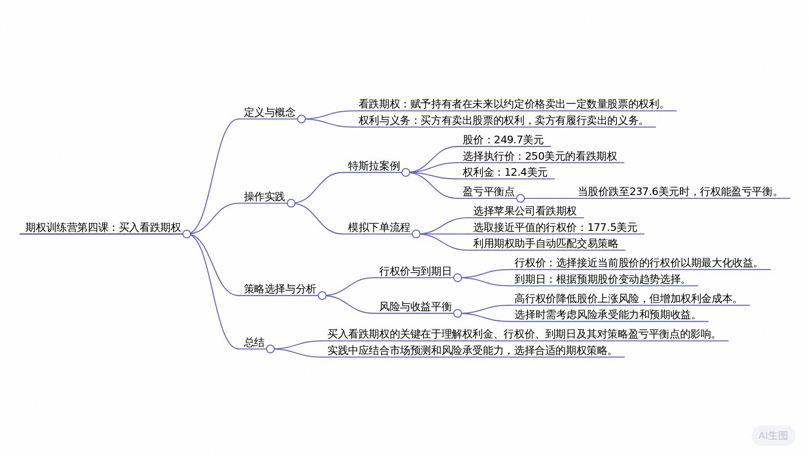

# 老虎期权训练营DAY4学习笔记

## 2024年12月16日 

[通义分析（含录音）](https://lxblog.com/efficiency/U/dXc0o8SFHCqgE1hPl8zDhSPcg0Bk5fO5)

### 思维导图

### 课程内容摘要

讲师在对话中首先阐述了看跌期权的基础概念，说明了买方在将来有权按约定价格卖出股票的权利。通过实例，讲师进一步解释了在股价下跌时，如何利用看跌期权获利，以及通过股价与执行价格的差价减去权利金成本来判断盈亏平衡点的重要性。讲师强调了选择执行价格和到期日对策略影响的深度，并讨论了期权风险与成本之间的平衡。最后，讲师通过实际操作演示，在老虎国际APP中如何买入看跌期权，借助期权助手功能进行策略匹配，为学员提供了实用的操作指导，整个对话旨在教授学员如何理解和操作买入看跌期权策略，涵盖了理论知识、盈亏计算及实际操作步骤。

### 要点回顾

**问：** 看跌期权的基本定义是什么？
>看跌期权是指买方拥有在未来特定日期或之前，以约定价格向卖方卖出一定数量股票的权利。

**问：** 买入看跌期权后，在什么情况下会行使权利？
>当未来股票价格低于约定的执行价时，我们会行使看跌期权的权利，因为这样可以通过以执行价卖出股票并利用更高市场价格获取价差利润。

**问：** 什么情况下买入看跌期权的买方会放弃权利？
>买方会放弃权利是在预期股价不会下跌到执行价以下，或者已经形成亏损时，即当行权后的收益不足以弥补权利金成本。

**问：** 买入看跌期权的盈亏平衡点在哪里？
>盈亏平衡点发生在股价跌至等于执行价减去权利金的成本时。例如，如果权利金为30美元，执行价为100美元，则股价至少需要跌到70美元才能达到盈亏平衡。

**问：** 在实际案例中，如何确定行权和盈亏平衡的条件？
>在特斯拉看跌期权的例子中，当股价低于250美元时可以行权；而盈亏平衡点出现在股价跌至237.6美元左右，这时行权可以获得足以cover掉12.4美元权利金成本的价差，实现盈亏平衡。

**问：** 在买入看跌期权时，如何选择行权价格和到期日？
>行权价格的选择应基于对未来股价走势的判断，而到期日则需考虑期权的时间价值衰减以及自身投资策略。在这个案例中，选择了250美元的执行价和二三年9月8号到期的期权。

**问：** 对于看跌期权的到期日，我们应该如何选择？
>看跌期权的到期日应该与我们对股价下跌的预判时间节点保持一致。例如，如果你预测特斯拉股票一周后会跌，那么看跌期权的到期日也应选为一周后；如果认为一个月后才会跌，则选择一个月后的到期日。

**问：** 行权价选得越高，风险和成本会有什么变化？
>行权价选得越高，对应的风险实际上越低，因为股价超过行权价的可能性增大，从而更容易获得收益。但是，随着行权价的提高，看跌期权的价格也会相应增加，意味着购买这样的期权所需付出的成本更高。因此，在实际操作中，需要在风险与收益之间寻找平衡，避免盲目追求过高的行权价。

**问：** 如何通过模拟盘下单购买看跌期权？
>首先，在老虎国际手机APP中打开行情界面并搜索目标股票（如苹果公司股票），找到期权链行情界面后，选择近似平值的看跌期权作为买入对象。根据当前股价调整行权价，并通过点击下单界面中的模拟买入按钮来提交订单。最终确认订单状态及成交情况，也可以利用期权助手自动匹配合适的看跌期权策略。

**问：** 行权价该如何选择？
>行权价的选择要基于我们对股价下跌幅度的预期。比如在给出的例子中，选择接近平值的250美元行权价。但理论上可以选得更高，如255或260美元，这会使得风险相对较低，因为只要股价低于行权价，就能获取利润。然而，行权价越高，看跌期权的价格（权利金）也会越贵。

### 大模型问答学习

### 课后打卡

本次打卡是模拟交易截图

### 课程听记原文

老虎期权训练营DAY4_原文
2024年12月16日 11:49
00:04
Hello, 小伙伴们，大家好，欢迎来到我们的期权训练营的第四课。今天我们来教大家如何买入看跌期权。首先来回顾一下基本定义，什么叫做看跌期权呢？那就是说买方买了看跌期权的这个人，未来会有一个权利。

00:21
什么样的权利我们可以以约定的一个价格在未来向卖方卖出我们手中一定数量的一个股票。简单来说，我们买了一个看跌权，就代表我们未来有一个卖权可以卖出这个股票，这是我们的一个权利。

00:36
举个例子，假如说今天我们买了一个铺子，买了一个看跌期权，那么我们约定的价格是100美元。那就意味着说未来我们可以按我们约定的100美元的一个价格向卖方行使我们的权利。我们的一个什么样的权利呢？我们可以把我们手中的一个股票卖给这个卖方，对吧？所以这就是我们的一个权利，卖出股票的权利。

01:00
对于卖方而言，这是他的一个义务。如果说我们要行权，他就必须要配合履行他的义务。当然如果说我们不行权，那就没事儿了，对吧？我们可以放弃行权，所以这就是买入看跌期权的一个买方的基本权利。好，那么问题来了，请问大家，什么情况下我们做一个买方，我们会去行使我们的权利呢？

01:22
或者什么情况下，我们会放弃我们的权利呢？那一定是当我们形成有利可图的时候，对吧？假如说未来我们要卖的这个股票，它的价格跌到了80美元，那个时候我们会不会行使我们的权利呢？我们当然会对吧？因为我们约定的价格是100。换言之，等未来这个股价跌到了80，我们仍然可以按100美元的价格给它卖出去，卖给这个卖方，对吧？

01:47
所以如果说我们行权的话，我们就能从中间赚到20块钱。以100块钱的一个价格，把一个价值80块钱的股票卖给别人了。赚到20块钱的一个价差，对吧？好，这是第一个问题。什么情况下我们会行权。对于买入看跌期权而言，就是当股价小于执行价的时候，我们就会形成对吧？股价跌到了80，小于我们这个约定的100块钱的执行价。

02:11
好，第一个问题。第二个问题，什么情况下，我们才真正的盈亏平衡呢？举个例子，现在我们买入这个看跌期权对吧？我们行权赚了20块钱，但你说它真正的最终这个策略是盈利的吗？未必。

02:28
因为我们没有考虑一个东西叫做权利金。因为你买这个看跌期权的时候，你是不是也付出了一笔代价，一笔钱，这个权利金其实就买这个put的时候，这个put的一个价格，对吧？

02:40
如果说我跟你说，当时你买这个put的时候，你花了30美元，那么你把这个30美元在11块儿放进去计算一下，你看你最终还赚钱，你行权赚了20美元，但已扣减30美元的一个权利金的成本，最终还亏了十块钱。对吧？所以说我们算一下这个期权的买入，看跌期权的一个盈亏平衡点就非常重要。什么情况下我们才真正能盈亏平衡呢？只能说在这个例子里边，这个股价跌的不够多，才跌到了80。

03:08
如果说它跌到70的时候，你看是不是就平衡了，对吧？100减70，你行权你能赚30。刚好这30块钱扣减掉我们买这个期权的成本，30块最终是不是就变成零了，你就盈亏平衡了，对吧？所以买入看跌期权它的一个盈亏平衡点所在的一个股价。

03:27
那么这个股价正好要跌到等于执行价减权利金的时候，对吧？也就是说我们大眼睛嫖买宽带期权权利金是30美元，我们约定的执行价是100，对吧？那你至少这个股价得跌到70的时候，中间这个价差30才能cover掉或者覆盖掉我们这个期权权利金的一个成本。

03:46
这种情况下我们就不赚不赔了，这就是盈亏平衡点。好吧好，那么这个策略的一个基本原理我们明白了。接下来我们结合一个实际的案例，我们实操一下，我们以特斯拉的一个看跌期权为例。根据我们右边这样一个行情截图，现在特斯拉的一个股价是249.7块美元，对吧？那么我们取一个整，我们假设就是249好算。

04:12
好，特斯拉的这个看跌期权，我们选择这个执行价是250美元。也就是在这，我们选择一个250美元的一个执行价的看跌期权。那么买这个看跌期权的话，要花费12.4块的一个权利金。大家看这个行情截图里边，我们买前面我们讲过，你买一个看跌期权或者买一个看涨期权，你看的这个报价一定看的是卖盘报价，对吧？

04:38
人家愿意你这个价格卖的卖给你，你就必须以这个价格去买。好，基本信息都有了，不考虑手续费，不考虑佣金的。这个基础上，我们来算一下理论上我们什么时候侵权，什么时候盈亏平衡。好，首先第一点，什么时候我们会行权呢？

04:54
刚刚说过了，只要未来的股价低于我们那个执行价，我们都会行，对吧？现在我们的行权价250美元。那我问你以后等到期的那时候，我们这个股价跌到了240美元，那么你会行权吗？我肯定会行权的对吧？那就意味着说我们可以按照250美元的一个约定的这个价格，然后把我们手中一个价值240块美元的这个股票卖给这个对吧？

05:20
所以你通过行权可以直接获利10亿美元，对吧？这第一个条件，什么时候我们会行权对于买入看跌期权而言，只要它未来的股价小于执行价，对吧？小于这个250我们都是可以行权的。

05:35
好，然后第二点，什么时候我们才能的break even盈亏平衡，对吧？那么如果说要考虑，你会平衡的时候，你除了要考虑我们行权，可以赚到一个价差之外，你还要把权利金考虑进去，对吧？

05:49
好，我们来看根据我们刚才说的那个公式，是不是你我们未来的一个股价至少要跌到多少，至少要跌到这个差价，足以cover掉我们这个12.4块美元的一个权利金成本的时候，对吧？刚好等于0，不赚不赔的时候，我们这个值盈亏平衡点就出现了。所以这个股价未来至少跌了多少？237.6块左右的时候，我们才真正盈亏平衡。

06:18
因为我们倒过来算一下，当股价跌到237.6块的时候，我们行权刚好能够赚到12.4块美元的一个价差。也就是刚好等于我们的权利金，你再扣减掉权利金是不是就等于0，盈亏平衡了，对吧？所以说这个盈亏平衡点特别重要。

06:36
当我们真正买入看跌期权的时候，股价跌了，我们一定不能说股价一跌我们就真的赚钱了，对吧？至少是有一个关键的一个值的。当然这一切是基于不要考虑什么额外的手续费，佣金这些对吧？这些都要具体问题具体分析了。好，这是我们买入特斯拉坑爹期权的一个实际案例。

06:57
好，此次问题来了，因为基本信息我都已经跟大家说过，对吧？但是在这个例子里边，为什么我们执行价就选了250，以及买入看跌期权这个到期日这个时间节点我们该怎么去选呢？在这个例子里边儿我们选了二三年的9月8号到期的一个开店期权，对吧？所以第一个问题，对于买入看跌期权而言，行权价格到期日我们该怎么去选？

07:21
首先第一个到期日的一个问题，对于到期日我们应该选什么时候呢？我们上一节课跟大家说过了，一切都以我们对股价的一个预判时间节点为准。你认为特斯拉它的股票它啥时候跌？

07:37
它是一周以后跌还是一个月以后跌，还是一年以后跌，对吧？那你如果说认为一周以后特斯拉的股价会跌，你要通过买个看跌期权去赚钱，那你这个看跌期权的到期日也是选一周以后。如果你认为特斯拉股票一个月以后才会跌，那你这个看跌期权到期的，你也选一个月以后，对吧？

07:57
看跌期权的到期，一定要跟这个对股价的一个预判的这个时间时间节点保持一致就行了。这是第一块，很简单，第二块行权价我们该怎么去选？刚刚我们这个例子直接选了250美元，就接近平值的一个看跌期权了，对吧？但是不完全是平值，因为跟股价还是差那么一点。

08:15
好，那么对于看跌期权买入看跌期权而言，既然我们买入看跌期权是未来，我们要把这个股价高价卖给卖方，对吧？所以我们买了这个坑爹钱钱之后，我们是希望这个股价越跌越好，跌的越猛越好，对吧？所以换言之，我们这个执行价选的越高。对于我们来说，风险对吧？

08:39
你现在我们资金量是250的，比如说我们选三百，我们恨不得选那个一千。因为你资金价选择越高，未来它大于我们这个股价的一个可能性也就越大，对吧？因为只要是大于股价，我们就可以形成获利，对吧？

08:53
所以按照这个逻辑，我们总结一下，我们对于买入看跌期权而言，我们的行权价选的越高。一般而言，我们买入看跌期权的这个风险那就越低，对吧？反过来说，形成债权的越低，那么风险越高。

09:11
举个很简单的例子，假如说你预判特斯拉未来的股价会跌到230美元。你说你的情形下选，比如选250，它的风险大一点，还是选三百的风险大一点。因为你选250，对吧？因为股价从二未来这个超过250的可能性远远大于超过300的可能性，对吧？

09:33
一旦超过250的话，是不是你这个产品线就废掉了，你就赚不到钱了。所以一定情形下选择越大，对吧？未来它大于这个股价的可能性也就越大。好，与此由此我们就推出来这个风险的一个大小，对吧？

09:47
同样的一个问题，很多同学就会说了，如果是这样的话，如果我要买这个看跌期权，我形象我就选择越大越好，对吧？我恨不得选到1万，可不可以？理论上是可以的，但是你还要考虑一个东西，对于买入看跌期权而言，你的行政价选的越高，你这个看跌期权的价格也就越贵。

10:06
或者说我们说权利金也就越贵，因为这个世界上没有白吃的午餐，对吧？谁都知道，我把肯定就像行政这样显得高一点，对吧？对我来说风险比较小。自然而然这个高形象价的看跌期权价格也就越贵。我们结合右边这个行情图，我们来对比一下。

10:23
你看250美元行权价的一个看跌期权，现在卖盘报价是12.4块。如果说你把这个情况下选择高一点，比如说我们选择255美元，所以你看这个开店期权的报价一下子涨到15块。

10:40
那再往下，如果是260的话，一下就涨到18块，对吧？所以说虽然我们风险小了，但是我们权利一定会贵。由此是不是我们买入这个坑爹钱，你钱人家选的越高，你的成本也就越高，你要花更多的钱去买它。

10:56
那就意味着说同样的这个股价的一个涨幅的话，有可能你的收益就是越低的，不考虑其他条件，对吧？

11:05
所以说永远我们对于这个看跌期权而言，永远都是一个风险的收益中间做一个baLance, 做一个均衡，那么你自己去考虑。好的，接下来我们就带着大家对于这个买入看跌期权，我们用模拟盘下一单。同样我们首先还是要打开我们老虎国际的一个手机APP, 打开这个行情界面之后，我们知道你要买入看跌前，你总得选好一个标的的股票，对吧？

11:33
具体是买入哪个公司的一个股票的看跌期权。假如说我们现在是买入苹果公司的看跌期权，那么首先我们要把苹果的一个股票界面给它调出来了。搜出来之后，我们看一下这个页面的上方这个概览的右边有一个期权两个字，点击一下。好，这个苹果公司相关的一个股票的看跌期权的这个期权链的行情界面就调出来了，那么这个行情界面怎么看呢？

11:59
我们在上一节课给大家讲过，这是一个梯形的一个展示界面，看涨期权在左边，看跌期权在右边。既然我们现在要买入看跌期权，首先行权价的一个选择上面我们假如说我们去选一个近似平值的一个看跌起来。

12:15
因为现在苹果公司的一个总价是177.45块，对吧？就这个界面的一个最上方已经给我们显示出来了。我们现在假如说我们选择看跌期权的行权价，选哪个价位呢？假如说选择177.5块，就是接近平值的一个期权了，对吧？

12:33
就是他俩接近了近似这个平值期权。既然我们现在要买看跌期权，那就在右边，对吧？那么右边有一个什么最新价涨跌幅，买盘之类的，你就随便点一个参数，对吧？你就可以把我们期权的这个下单界面给它调出来。最往右左下角有一个模拟买入的一个按钮，我们点击一下。

12:56
然后此时这个下单界面就出来了，比如说钱一张或者一首，下面这个金额就出来了，那么我们点击买入下。好，然后点击确认。OK这个订单现在就已经成交了，成交，已经提交了。提交完之后，我们回过头来看一下这个订单，我们在哪能看到，怎么去看他有没有成交呢。

13:21
同样回到我们这个主页，点击一下右下角的我的，然后再点击模拟账户OK我们刚刚下的这一单，就是苹果的这个POS. 

13:31
这一单现在显示这个订单已经提交了，所以说现在还没有开盘，也是没法成交的OK这就是我们这个模拟下单的一个流程。当然了，刚才在讲到我们那个看跌期权对吧？它的期权价它的到期是怎么去选的一个问题。可能很多同学会觉得有点很麻烦，对吧？我能不能就直接这个APP自动给我匹配？

13:54
是可以的，我们用一下这个期权助手是可以自动跟我们匹配的。还是以刚刚苹果为例，把这个苹果的期权界面调出来之后，大家可以看到这个期权链的这个行情界面。期权链的右边有什么大单异动？期权分析，期权注册。

14:11
我们点击一下这个期权注册OK, 这个筛选界面就出来了。首先第一栏，你选我目前有没有持有苹果的一个股票。一般来说，我们既然要买一个空间钱，大部分情况下都是一个裸买的一个状态。

14:26
就我手中没有股票，我单纯就是因为我单纯就是看空这个苹果公司的股票。我认为苹果公司的股价未来会跌，对吧？所以我通过买入它的看跌期权去获利，所以我手中有可能就没有持有这个股票。你没有持有的话，你就选择空仓就行了，对吧？

14:44
当然说如果说你持有的苹果公司的股票，你用它未来下跌，你可能利用哪个宽带资源去做一个对冲。对吧？那你就选择多投，这是不同的选项。一般情况下我们基本就选空仓了。你没有苹果公司的股票，你就选空仓。那么下面这一栏，我预计苹果的股价会干嘛？

15:03
既然我们现在要买入看跌，当然我们就认为未来苹果公司的这个股价有可能会下跌，对吧？你看空，所以我们选择把这个上涨调整为下跌，选择下跌后面这个单后面有一个时间点，这个时间点就是你认为未来是哪个日期之前，这个苹果公司的股价会下跌，对吧？

15:23
你这个日期选好之后，后面给你推荐了一个看跌期权的到期日，就跟这个日期是保持一致的。好，接下来下面给我们推荐的投资策略自动就弹出来了，我们的投资策略推荐的是买入认沽期权，所以认沽期权就是看跌期权的意思。还记得我们在上一节课的时候跟大家讲过，对吧？认购就是看涨期权的意思就是看涨的意思。

15:48
那么任务就是看跌期权的意思，或者看空的意思。好，那么此时这个选项推荐好之后，下面我有一个我偏好delta的一个取值区间。

16:02
我们在上节课说过，现在我们处于一个小白阶段，大家也不知道跟期权相关的什么delta参数、demo参数，这些到底是什么意思，对那么如果这样的话，大家一般默认就是他默认给你是0.5到0.8，你基本上就不用改它就行了，对吧？大家只需要记住一个逻辑，德耳塔值越大的话，就代表这个期权受股票波动的一个敏感度就越大。

16:26
相对来说风险就稍微大一点，所以你明白这个逻辑的话，如果你觉得我有点接受不了这个风险，你就把delta这个参数选择小一点就行了。好，这个弄好之后就点击下一步，自动就把我们这个推荐的一个相关的策略就推荐给我们了，就推荐我们买入苹果的。二三年8月18号到期的执行价为177.5块美元的一个破产看跌期权。

16:51
我们点击模拟交易就可以直接下单了，就又弹回到我们刚刚那个下单界面了。

16:58
好，这就利用期权助手自动帮我们匹配的一个功能。

17:03
好，那么今天我们这个买入看跌期权这一节课就给大家讲完了，谢谢大家。

