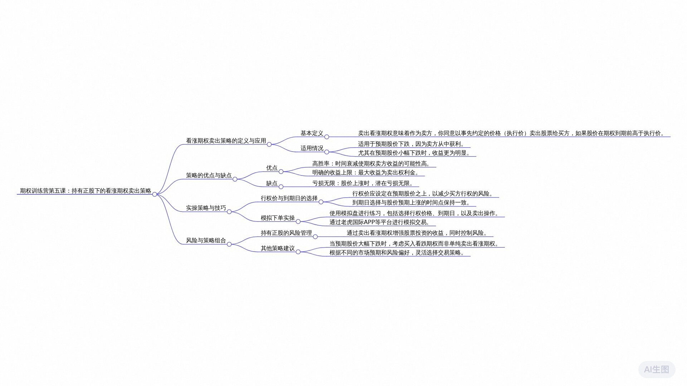

# 老虎期权训练营DAY5学习笔记

## 2024年12月17日 

[通义分析（含录音）](https://lxblog.com/efficiency/U/XJoZiGGkEG06RIfhzMROzIuhtRxFTbmC)

### 思维导图

### 课程内容摘要

讲师在对话中首先阐述了卖出看涨期权的基本概念，强调了卖方在预期股价下跌时通过卖出看涨期权增加收益的策略。此策略的优势包括提高操作成功率和限制潜在亏损，但收益亦有上限。讲师特别指出，在持有正股的基础上实施该策略能有效对冲亏损并增强收益。此外，强调了期权时间价值的重要性，并指导如何通过选择合适的行权价格和到期日来优化策略。通过模拟盘操作，讲师演示了如何在模拟环境中选择行权价格和到期日，以及如何使用期权助手辅助策略制定和执行。强调了对未来股价预期在策略制定中的关键作用，旨在帮助学员在模拟环境中灵活运用卖出看涨期权的理论与实践知识。

### 要点回顾

**问：** 卖出看涨期权的基本定义是什么？
>卖出看涨期权是指作为卖方承诺在将来某个时间以约定的价格（执行价）买入对方手中股票的义务。与买方拥有在股价上涨时按约定价格买入股票的权利不同，卖方在股价上涨时需要履行卖出股票的义务，若股价下跌，则卖方通过收取权利金获利。

**问：** 卖出看涨期权适用于什么情况？为何在预计股价大幅下跌时，选择卖出看涨期权而非直接买入股票？
>该策略适用于预期未来股价可能会下跌的情况。当卖方预计股价下跌时，可以通过卖出看涨期权来赚取权利金收益，因为只要股价下跌，卖方就能在约定的价格下卖出股票并获得利润。尽管股价下跌时卖出看涨期权也能盈利，但收益是有限的，仅限于权利金。而作为买方，无论是买入看涨期权还是看跌期权，亏损都是有限的（最大为权利金），但潜在收益理论上可以无限大。因此，在股价大幅下跌时，买方更倾向于买入看跌期权以获得更大的收益空间。

**问：** 期权卖方为何胜率较高？
>期权卖方之所以胜率较高，是因为随着时间的推移，期权的时间价值会不断流失。对于买方而言，随着到期日临近，期权的时间价值减少，期权价格可能下跌，即使股价未朝不利方向变动，买方也可能出现账面亏损。而作为卖方，由于时间价值的流逝，买方可能被迫平仓，从而实现卖方的盈利。因此，在长期来看，期权卖方具有较高的胜率。

**问：** 在期权交易中，卖方的主要优势是什么？
>卖方的主要优势在于随着时间的推移，股价不变或轻微上涨时，他们可以在赚取时间价值方面占据优势，即使股价略有上涨也可能实现盈利，因此胜率较高。

**问：** 卖方策略的缺点是什么？
>卖方策略的最大缺点是收益有限，主要收益来自于卖出期权时收取的权利金，比如卖出一个看涨期权可能得到10美元的权利金，而最大收益就是这10美元，无论未来股价如何波动。

**问：** 卖方策略的亏损情况如何？持有股票的情况下，卖方策略如何避免无限亏损的风险？
>卖方的亏损是无限的，如果股价朝着不利方向大幅上涨，卖方可能需要以高于约定执行价的价格购回股票进行交割，导致亏损不断增大。如果卖方原本就持有相应的股票，并且股价上涨，由于有股票作为抵押品，即使按照更高的价格交割给买方，卖方仍可以通过股票升值来对冲掉额外的亏损。同时，卖方在卖出期权时收取的权利金提供了初始盈利保障。

**问：** 如何通过精心选择执行价来提高卖方策略的盈利可能性？
>在卖出期权时，卖方会根据对未来股价的预期设定一个高于当前股价的执行价，这样可以减少期权被行权的风险，并争取在权利金上获得一定的收益。例如，若预期股价未来上涨到105美元，可以将执行价设定在106美元以上，这样即使股价上涨，卖方也能通过权利金收入实现稳定盈利。

**问：** 在星巴克股票上，你通过什么策略赚取了收益？
>我持有的星巴克股票从101美元涨到了105美元，赚到了4美元的差价。然后我在106美元的价格卖出一个看涨期权（即call），这样即使股价上涨，我还能额外赚取权利金，总共赚了6美元。

**问：** 为什么在持有正股的情况下能增强收益？
>持有正股时，通过卖出一个看涨期权可以增强收益，因为当股价上涨时，除了原本持股的潜在增值外，还能从卖出看涨期权中获取权利金收入。例如，若预期星巴克股价只能涨到105美元，我可以在106美元的价格卖出看涨期权，这样即使股价上涨，我仍能赚取额外的2美元权利金。

**问：** 什么是背对看涨期权策略，如何操作？
>背对看涨期权策略就是在持有股票的同时卖出一个看涨期权。具体操作是在持有星巴克股票的同时，在预期股价上限附近设定一个较高的行权价格（如106美元），从而在股价未达到预判上涨点时，卖出看涨期权赚取权利金，以此增强整体收益。

**问：** 如何选择合适的行权价格和到期日？
>行权价格的选择应基于对未来股价的预判，要设定在一个未来股价大概率不会触及的价位上，以降低被行权的风险。至于到期日，通常与对未来股价走势的时间节点保持一致即可。

**问：** 模拟下单实操时，如何选择特斯拉股票的行权价和到期日？
>在模拟下单实操中，首先确定特斯拉股票现价（例如225.6块），然后根据预期股价上涨幅度选择合适的行权价（例如选在227.5块），并选择相应的到期日（例如二三年8月18日）。接下来，在老虎国际APP中搜索并点击特斯拉股票期权，设置卖出订单，选择合适的行权价和到期日，最后确认并提交卖出订单。

### 大模型问答学习

### 课后打卡

次打卡是模拟交易截图

### 课程听记原文

老虎期权训练营DAY5_原文
2024年12月17日 10:22
00:05
好，同学们大家好，欢迎来到我们的期权训练营的第五课。今天我们来讲，在持有正股的情况下，我们如何通过卖出一个看涨期权来增加收益。好，首先来看一下卖出看涨期权的一个基本定义，对吧？很多同学会觉得很绕，买说买方买看涨期权的时候，你觉得还好，容易理解，对吧？

00:28
但一旦作为卖方的时候，就有点绕过这个弯，就不知道说卖出这个看涨期权到底股价上涨对我来说是好事儿。可是下跌对我来说是好事儿，对吧？

00:36
没关系，今天我们来教大家一个简单的方法，如果你觉得这个绕OK你把这个买看涨期权，我们在前面讲这个买靠把这个理解透了。那你这个其实就是一个反方向，对吧？

00:50
我们在前面讲买入看涨期权，我们作为一个买方，这不代表未来我们有一个权利，什么样的一个权利，简单来说就是买股票的权利。我们未来可以按我们约定的一个执行价，一个形象价格去买入这个卖方手中的一个股票，对吧？就买股票的一个权利。反过来说，卖出可能钱我们就换方向了，我们就是一个卖方了。如果说买方是有一个权利的话，那么卖方就是一个义务，对吧？

01:13
那么如果说买方未来是买股票的一个权利，那么卖方就是一个未来一定卖股票的一个义务了。如果买方来找我们形成的话，这就是我们的一个义务。我们就需要把我们手中的股票卖给他，对吧？

01:26
如果说买方买call的人盼着股价上涨的，当然了，对吧？因为我要买股票，我们约定的一个价格已经约定好了。

01:36
所以说如果说未来股价上涨高于我们的指定价，对吧，那么我们就可以行权获利，所以买方判断是股价上涨的话，那么卖出看涨期间这一方，其实我就盼着股价未来下跌上涨它能获利，那下跌我就能获利了。因为我们俩就是一个对手方，对吧？好，这是卖出看涨期权的一个基本定义。所以说卖出看涨期权适用于什么情况呢？

01:59
这个策略适用于未来，我预期未来股价可能会下跌，那么我就会卖一个靠我就能赚钱，对吧？那有没有同学觉得有疑问？既然这样的话，我盼着股价下跌，那你为啥还说未来预计股价小幅下跌的话，我们卖高，那你原来这些数据如果说大跌的时候，就不适用于麦克风，了呢？其实也适用于对吧？

02:21
只要股价下跌，其实我卖高都能赚钱，那为什么尽量就是小幅下跌？我们要其实很简单，如果说你预计未来股价是大跌，并且对方肯定的时候，我干嘛不买兔子呢？那第三年的时候讲了买裤子了，对吧？

02:36
我们说作为买方，无论你买高还是买铺子，我们的亏损是有限的，大不了我们亏一个权利金，我不行权了。但我们的收益是无限的，收益理论可以特别大，对吧？所以说你看股价大跌的时候，干嘛不买普通的，那我收益可以放的非常大，对吧？我是一个大专的一个情况下，我就不用卖高了，为什么？

02:56
虽然卖高，在大跌的情况下也能赚钱，但你的收益是有限的。这就不得不说我们作为期权的一个卖方，要给大家总结两个我们没见过的两个特点。首先第一个作为期权的卖方，我们的胜率是非常高的，为什么这么说呢？

03:12
因为做经常做期权的朋友们应该听说过一句话，期权的卖方其实就是一个时间的朋友。为什么给大家举个例子，同样是站在买方的一个角度来说，假如说我今天买一个call, 买了call的时候花了一个权利金，花费了权利金其实是期权的价格，对吧？我们花了十美元买了这个期权，对吧？

03:32
我们说期权的权利金其实包含两块，期权的价格包含了2 1个叫内在价值，一个叫时间。可能听起来有点晦涩，没关系，大家现在不用理解的特别透，对吧？

03:43
而我们买方注定了就买入期权的这一刻，随着时间的不断推移，不断的接近到期日。你这个期权的时间价值在不断的流失，对吧？如果说你做过期权，你会发现给大家举一个例子，我们今天买的这个高权利金是10美元，对吧？

04:02
我们约定的执行价是100美元，股价现在也是100美元，现价假如这个期限是七天，一共到期，对吧？今天是第一天，我们股价是100美元，对吧？然后这个期权的价格十块钱，也就权利金，对吧？

04:18
这个扣权利金是10美元，第二天你会发现股价没有变，股价第二天还是一般变股价不涨不跌。但是你会惊奇的发现，你这个高第二天跌到九块。了。举个例子，然后第三天的时候，同样股价还是100美元，涨不跌没变。

04:35
第三天你又会惊奇的发现，你的股价，你这个看涨期权的价格跌到八块钱了，你每天都在亏钱买靠的这一方，对吧？然后作为这个买方，其实心里边也是有苦说不出来，也很无奈，对吧？你说我买了一个靠股价没有朝我不利的方向变动，股价并没有跌，它没跌，为啥我就一直亏钱呢？

04:55
甚至有可能说股价朝我有利的方向变道。第三天可能股价涨到100 0 100.5美元的股价轻微上涨了，有可能我在看涨期权的价格都是跌的，有可能都跌到8美元，对吧？为什么这样？你看大家我给大家举一个例子，现在惠普的这个期权链行情在这放着。

05:13
你看惠普这一天它的股价是跌的对吧？按理说股价当天下跌了，对于我们买put的这一方，它的看跌期权价格肯定是应该上涨，对吧？但你看这天看跌期权的价格还是下跌的，跌跌的还不轻，对吧？其实就跟我们这个例子是一样的，股价这几天轻易上涨了。

05:34
然后你看涨期权的价格还在跌，为什么？就是因为时间价值的流逝，期权每分每秒，它的时间价值都在流失。为什么？因为我们前面说了，期权它的到期日长，它的时间价值就越大，懂吗？所以说你买了这个看涨期权之后，你随着？你第一天第二天、第三天不断的接近我们的到期日，你的到期日越来越接近，对吧？

06:00
你的时间越来越短，你的时间价值也就越来越少，对吧？这是不断的牛市，这一点的话，以后大家做做一下这个期权的买方，你去买一下这个看涨期权或者看跌期权，你慢慢的看一下，你就会懂这个道理。

06:14
其实就是我们说啥用生活化的角度来说，就是夜长梦多。期权就是赌一个波动，对吧？时间越长，就这个不确定性就越大。但随着这个夜越来越短，梦做梦也越来越少，对吧？

06:27
确定性越来越确定的时候，你这个看涨期权就没你这个期权作为买方，你就没对你来说没什么价值了。因为他越来越确定对吧？而卖方刚好相反。

06:38
如果买方每天在不断的接受这个时间价值的一个衰减的话，那么卖方的话，刚好他每天就在不断的获取这个时间价值。懂吗？所以说他胜率特别高。像我们这种情况，如果说我们卖了一个靠我卖了一个靠，然后随着时间的推移，股价不变，股价不涨不跌，那么我也赚钱。因为我在赚时间价值，甚至说股价有点儿轻微的小幅上涨，我都有可能是赚钱的。

07:13
我注意，我说的有可能，因为为什么呢？因为股价上涨确实对我来说是一个不利的一个变动，对吧？但是这个不利的变动有可能幅度太小了。敌不过我每天时间价值的一个增加，对吧？或者时间价值给我带来一个收益，所以最终有可能我还是赚钱的，所以它胜率比较高。好，但胜率高。

07:34
也就意味着说它也有缺点，它的缺点就是收益有限，它最大的一个收益其实就是一个权益金。他最大的一个收益其实就是一个权利金的一个收入。假如说我们今天卖了一个框，那么获取了10美元的一个产品经理，我其实就盼着未来股价，对吧？就没有不会超过不利的方向变动。

07:52
未来我就判断未来买方那不行，权，我是不是十块钱权利金就白赚了，对吧？所以我最大收益其实就是这个十块钱的权利金，收益非常有限。所以就意味着说，虽然你胜率高，你大概率能赚钱，但你赚不多，对吧？

08:07
OK然而，它的亏损就是无限的，所以为什么我们一会儿会说，我们一定要持有在持有政府情况下，如果你单独持股卖可能你的风险会很大，因为你的亏损有可能无限的。一旦朝着你不利的一个方向变动，有可能你的亏损，对吧？

08:24
真的是说不说，不准，为什么给大家举个例子，大家就知道了，我们以卖出星巴克的探讨经常为例，基本信息就这样简单一点。然后现在星巴克的股价是101美元，我们卖的这个开场之前的执行价也是100 0，对吧？我们卖出这个探讨清源这一刻，我们就收到了2.94美元的一个权益金。

08:44
也就意味着说卖出看涨期权这一刻，我们的最大收益其实就是2.94，对吧？你就盼望着未来买房不来找我侵权，我最大就赚到这笔钱，对吧？好，基于这种情况下，基于这三个条件，假如说我给大家举个例子，一旦未来股价涨到了200美元的时候，买房肯定来找我侵权，对吧？

09:07
一旦买方来找我侵权，因为我们约定的执行价是101，就意味着说买方未来要以100亿美元的一个约定的价格要买我手中一个价值200美元的股票。

09:19
那么我是要的要把这200美元的股票低价卖给他，跟我说就亏个99美元，对吧？好，那是这种情况。我假如说因为股价上涨，从股票上来说是没有底的。如果万一涨到300，那么他就要吧？要按101美元的价格，以300或者买我手中300美元的一个股票，那我可能就亏199。

09:42
如果说涨了400，那我就亏299了，对吧？那银行来说，万一涨到1万了，那我可能就亏，对吧？9900这个99块对吧？也不用细算，是吧？万一涨到一个亿了，对吧？所以股价不断的往上涨，那你亏损就不断的变大，对吧？因为资金价格约定好的，对吧？

10:03
当然，这是基于你手中没有股票的成本，对吧？你手头上没有股票的话，以后他来找你行权，你就必须。现在比如说现在股价涨到300，你就必须自己花掏腰包，花300块钱手里买到这个股票，然后再给他交割，对吧？

10:18
把这个股票交给他，所以说一旦涨到一个亿，你真的要花一个亿去买去市场上买这个股票，然后按101的价格去交给买方，对吧？所以这就为什么它的亏损是无限的，就是这个道理。

10:32
但是一旦我们手中本来持有的就有这个星巴克的股票，这个时候我们就不怕了，对吧？那你说股价涨到零两百美元，我不怕说到时候按101美元的一个价格，对吧？买我手中一个价值200美元的一个股票，我亏九十九没关系，为什么？因为这个我在一开始卖这个car call的时候，我手中本来就持有的有星巴克的股票，对吧？

10:56
假如说我当时本来我手中那个星巴克的股票，对于我来说成本，因为当时股票的现价就是100。我的麦克风齐全的这个同时我就已经有这个股票了，对吧？我在一开始持有这个股票没关系，未来股价涨到200对吧？

11:12
那我的手中的股票从101涨到200，那我是不是，首先首先这个股票都已经帮我增值了99块，对吧？所以刚好能对冲掉，到时候把这个股票交给这个买方，吧？

11:25
那刚好不赚不赔，所以说只要手中有股票，哪怕这个股价涨到一个亿，我也对吧？无论涨了多少，我手中就有这个股票来给他交割，就把这个股票交给他，对吧？就是这个含义有同学会说了，如果你是这样的话，那你那搞这个策略有什么意义呢？你永远都是吧？不亏，对吧？

11:46
但是你不要忘了，我们卖这个copy的时候，我收到了290美元的权利，对吧？所以在一开始的时候，就这个盈利看似是很稳的，对吧？并且很多人在实操的时候，我们没有那么傻，对吧？就把什么期权的执行价，跟股价去这个选的是一样的。

12:07
我们很大概率我们玩这个东西，我们就是要大概率去赚钱，执行价上面我们要下一番功夫。我这样给大家操作一下，这样大家就知道这个策略的一个神奇之处了。现在股价是101美元，因为我们说你无论是买高还是卖高，你永远都是对未来股价有一个预期，有一个预判。不然的话你就这样相当于在赌了，对吧？

12:27
我假设未来股价可以涨到105美元，对吧？此时的话，我卖call的这一方，因为我希望买方不会来找我侵权，那我就把这个侵权价定到多少，定高一点，比如定到106对吧？卖这个如果是定到106这个直营价的话，那你可能这个靠的价格会便宜一点，可能你收到的权利金假设只有2美元的一个权利金，对吧？那现在星巴克的一个股票？

12:54
我们现在我为了稳一点，我现在就先买入星巴克的股票，我怕未来没有股票给他交割，对吧？按现在的一个价格，101美元对吧？你先买的这个股票。好，我们预期未来星巴克股价涨到105。如果星巴克股价增长到105，没关系，卖方买方不会来找我侵权，因为我们的约定的执行价是106万，对吧？

13:18
所以在这个策略的情况下，首先我就赚到了两美元的一个权利，对吧？其实我又赚到了一个什么？

13:25
我当时星巴克的在我手里边，星巴克的一个股票是不是这个价值101美元，现在涨到105了，就是中间那个差价是400元，我又赚到了，应该是105减101，我又赚到了一个四美元的一个差价。你看这样下去，我是不是一下赚到6美元，对吧？这就回到了我们前面第四课的一个主题。

13:45
为什么我们这节课这个策略说持有正股的情况下还能增强收益？你看是不是这个道理，如果说你只有星巴克的一个股价从101涨到105，你赚到了4美元，仅仅4美元而已，对吧？但是我在106的价位上，我再卖一个坑，我又能多赚2美元的一个权利金。你为什么敢卖这个套？因为我们现在对星巴克股价的一个预期，就是它只能涨到105。

14:10
所以我就专门把这个靠的资金价定到106，不让他来侵权，对吧？所以说这个策略我们从一cover的call叫背对看涨期权策略。名字听起来高大上，其实很简单，就在持有股票的基础上，再卖一个call，就OK了。卖call是为了增强收益，对吧？因为你持有股票可能股价是轻微上涨，我卖靠的时候？

14:35
在他不会来找我，倾向我再赚一笔，对吧？所以说你看股价小幅下跌的时候，我们卖高也能赚钱。股价我预期未来会上涨，对吧？只要我对这个上涨的这个目标价有一个情绪的预判，我把执行价调的高一点，我还是能赚钱这个策略的一个稳妥之处，当然这一切假设都是基于我们不考虑什么权利，这个手续费还有佣金这些小头对吧？

15:03
就是这个钱都已经是很少了，没有考虑这些乱七八糟的。好，明白了这个基本原理之后，接下来我们对于这个麦克风模拟盘实操一下。好，首先就是麦克风这个行行权价格到期日的一个选择。首先到期日的一个选择，我们在前面讲买call买put的时候已经说过无数遍了。到其实就一个原则，你就跟对于未来股价预判的一个时间节点保持一致就行了，对吧？

15:32
我就不再说了，主要就是行权价，行权价怎么去选。通过刚才我给大家举的这个例子，大家应该也清楚了。行，权价你要卖高，简单来说我就是盼着买方他不行权，这什么情况下不行权，就未来股价小于我们的执行价，对吧？

15:49
你比如说现在股价100，我预计未来股价能涨到105，那我就偏偏就把这个靠的资金量选择106，我就要大于未来对股价的一个预判，从而让它不行权，对吧？所以行权价怎么去选，就基于你对未来股价的一个预判，股价涨到什么价位吧？大概率能涨到什么价位，你就把这个行天下定到这个价位的上面，那么他就不会来找你侵权了。

16:13
所以行权价怎么去选，对吧？就跟股价对股价的一个预判，以这个为原则就行了。当然理论来说，肯定也是对于麦克风的一方，我不希望他来行权，那你一定行。权价选的越高，他不来找你，行权的概率就越大，对吧？所以行权价越高风险就越小。所以大家根据这个原则，你自己去预判就行了。

16:35
我们不做这样一个引导是吧？好，这是行权价跟到期日的一个选择的一个问题。接下来，我们就带着大家去模拟下单实操一下，模拟下单同样还是打开我们这个期权的一个我们的老虎国际的一个APP, 打开我们的行情界面，对吧？

16:58
那假如说我们今天要卖出一个特斯拉，假如说要卖特斯拉的一个，那么你同样首先要把特斯拉的股票行情给它拉出来，然后搜索特斯拉好股票行情拉出来之后，点击概览右边的这个期权。好，这个期权界面就出来了。现在特斯拉的股票的现价是225.6块，这是股票的一个价格，对吧？假如说我们现在要卖它的一个坑，假如说我们的执行价选在多少呢？

17:30
选在227.5块在我们的执行对吧？有我们要卖这个口号，到期日我们就选择二三年8月18，也就是我们现在默认的那个到期日，对吧？

17:41
然后我们点击一下这个好，然后这个行情界面就出来了，点击一下右左下角的这个模拟，卖出这个按钮。OK, 此时的话，这个下单界面就出来了，这个价格的话，你自己自由的去调，看你想不想立马成交，对吧？数量假如我们选择一张，对吧？

18:02
然后此时就点卖出下单就行了。OK, 然后点确认好，此时这个订单可能就提交了，怎么去看我们这个订单有没有成交？

18:16
还是那个路径，在主页的这个右下角点我的，然后点模拟账户。

18:24
OK。

18:25
好，那大家就会发现在这个今日订单里边，这个订单是不是就有了，卖出已提交对吧？但是现在还成交不了，为什么？因为现在美股还没开盘，对吧？就在那儿放着。好，这就是我们的模拟下单这个流程。同样我们还可以借助我们的期权助手来帮我们自动匹配。对吧？

18:43
你就不用自己去筛选了，然后以特斯拉为例，这个给大家演示一下，同样还是拉开我们这个期权的这个行情界，面对吧？然后在上面这一栏，什么期权链大单异动，然后期权分析，期权注册，点击一下期权注册OK. 此时我们这个匹配界面就出来了。好，两种情况。第一种情况，假如说我们真的就是一个裸卖，一个坑，就只卖一个，坑，你手中没有股票，无股票。

19:13
好写这里我们现在只有罗麦一个靠手中是没有股票的，没有证据。这种情况下，你就选择空仓呗，对吧？我们现在持有特斯拉股票，我们的供应商不持有，对吧？那我假设因为我们现在要卖空，那么肯定假设未来这个特斯拉股价会下跌，对吧？时间就选8月18号就行了。好，大家会发现下面给我们推荐的一个投资策略，买入认沽期权。

19:44
这就我们前面说了，你预计未来股价会下跌，对吧？

19:48
那么我们买put也可以赚钱，卖call也能赚钱，对吧？

19:53
只不过说如果说是小幅下跌的话，我们最好就卖高就行了，对吧？如果是大跌的话，你卖空也能赚钱。但是其实你如果真的预算大跌，你干嘛不买铺子呢？你赚的这个金额是远远大于这个盈利的。因为卖方我收益是有限的。

20:09
如果你真的非常肯定未来会大跌，你买pod就行了。对吧？所以说你看我们这个因为我们这个匹配功能没有选什么小幅下跌还是大幅下跌，对吧？所以但凡你选择下跌，它有可能给你推荐买入认沽期权，就是买pose。

20:24
会给你推荐买pose，对吧？

20:26
当然我们也可以自己选择去干嘛去卖call对吧？卖出认购期权也行，对吧？你可以自己去筛选，下面有一个预期年化收益率，看你想要多大的一个收益率，它就会给你推荐什么样的一个策略，然后点击下一步OK。那么按照不同的年化收益率对吧？

20:46
那么他就给你推荐各种各样的靠卖，靠你就选择一个就行了。假如说我们选择第一个模拟交易，好，这个下单界面就又出来了，对吧？就跟刚才一样了。好，这就利用侵权助手去自动匹配策略OK今天的话，我们这个卖出看涨期间，这个策略就给大家讲完了，谢谢大家。
