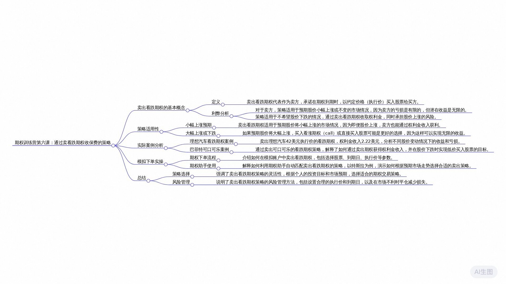

# 老虎期权训练营DAY6学习笔记

## 2024年12月18日 

[通义分析（含录音）](https://lxblog.com/efficiency/U/xYLFCGNkD04eclQgTzEBNg3AQ6cMMWDO)

### 思维导图

### 课程内容摘要

讲师在对话中首先阐述了卖出看跌期权的基本概念，通过对比买方与卖方的权益，解释了这一策略的操作逻辑。他强调，卖出看跌期权能够使投资者在股价上涨时获利，且卖方的潜在亏损有限，尤其适用于股价小幅上涨的情况。讲师以理想汽车为例，详细说明了该策略的实际应用，并引用了巴菲特使用类似策略抄底可口可乐的案例，展示了策略在实际投资中的成功运用。最后，讲师建议听众通过模拟盘实操来加深理解并应用该策略，强调了这一策略对预期股价小幅上涨的投资者尤为适用，旨在帮助听众掌握卖出看跌期权的逻辑、优势及其在不同市场条件下的应用。

### 要点回顾

**问：** 卖出看跌期权的基本概念是什么？
>卖出看跌期权是指作为卖方，在未来有义务以约定价格买入标的股票，而买方则拥有在未来按约定价格卖出股票的权利。如果买方期望股价下跌，他们可以通过买入看跌期权来获取收益；相反，卖方则是基于不希望股价下跌的预期进行操作。

**问：** 卖出看跌期权适用于什么样的市场预期？卖出看跌期权的收益和亏损是如何限制的？
>卖出看跌期权适用于未来股价小幅上涨的预期，因为在这种情况下，无论股价涨幅大小，只要股价不下跌，卖方就能从股价上涨中获利。若预期股价将大幅上涨，更适合买入call期权。对于卖方来说，收益是有限的，而亏损在理论上是无限的，但实际情况并非如此。股价下跌时，卖方的最大亏损是有限的，即当股价跌至执行价格以下时，卖方必须按约定价格买入股票，但股价不能低于0，因此亏损实际上有下限。

**问：** 为何称卖方收益为“无限”存在争议？
>虽然通常认为期权卖方收益有限、亏损无限，但在卖出看跌期权的情况下，其实际收益可能存在一定争议。虽然股价理论上可以无限上涨，但卖方可以通过止损机制限制实际亏损，从而使得收益看起来似乎并非完全有限。

**问：** 在期权交易中，当看跌期权的买方希望找您清算时，这种情况是如何发生的？
>当看跌期权的买方认为股价会下跌，他们会在期权执行价低于当前股价时提出行权。例如，如果执行价是42美元，当股价跌到40美元时，买方会按约定的12美元价格将40美元价值的股票卖给我们，从而赚取2美元差价。

**问：** 对于卖方而言，在什么情况下会亏损卖出看跌期权的策略？
>卖方卖出看跌期权最终可能亏损的情况是，股价大幅下跌至执行价以下，具体来说，如果股价从42美元跌至39.78美元，卖方不仅会亏掉权利金收入（2.22美元），而且还会亏掉额外的2美元。因此，当股价跌幅超过权利金收入时，卖方会处于亏损状态。

**问：** 巴菲特是如何运用卖铺策略进行投资的？巴菲特的卖铺策略有何特点和优势？
>巴菲特曾通过卖铺（即卖出看跌期权）来实现以35美元价格买入可口可乐股票的目标。他先支付了1.5美元的权利金卖出一个执行价为35美元的看跌期权。第一种情况是股价持续上涨不跌破35美元，他可以赚取1.5美元的权利金；第二种情况是股价跌至35美元但未跌破，他仍然可以按照35美元的价格抄底可口可乐股票，并且由于之前收取的权利金抵减了部分成本，实现更低成本的买入。即使股价跌破35美元，他也可以选择平仓止损。巴菲特的卖铺策略巧妙之处在于，它既能锁定一定的收益（权利金），又能利用期权未到期前的灵活性进行平仓操作以应对股价波动风险。如果股价未如预期下跌或未跌破关键点，卖方可以稳定获得权利金收益；若股价跌破预设价位，卖方可以平仓止损，同时依然有机会在低位抄底。这样的策略大概率能帮助投资者实现特定的投资意图，且降低了裸卖带来的无限风险。

**问：** 在期权交易中，如何根据买卖意图选择合适的行权价和到期日？
>在期权交易中，选择行权价和到期日时，需要考虑买卖的目的。例如，如果你想要抄底某股票，可以选取与股价预判下跌节点一致的到期日，并选择合适的行权价，该行权价应该接近或略低于你预期的抄底价位。若要进行裸卖操作，则可以选择更低的行权价以降低风险。

**问：** 如何在模拟盘实操中下单卖出特斯拉股票的看跌期权？
>在模拟盘实操中，首先打开老虎国际APP，进入股票界面后选择期权功能。假设要卖出227.5美元的特斯拉看跌期权，且到期日为8月18号，找到对应参数后点击下单，设置数量并确认订单。下单后可回到主页查看订单状态，等待模拟交易的成交反馈。

**问：** 如何使用期权助手自动匹配交易策略？
>在模拟盘实操中，通过点击期权界面上方的期权助手功能，根据自身持仓情况选择空仓或持有股票。以空仓为例，假设预计特斯拉股价会下跌，通过期权助手可以自动推荐相应的交易策略，如卖铺（认沽期权）。用户只需根据预期选择合适的卖出价格区间和预期年化收益，然后按照提示完成模拟下单流程即可。

**问：** 对于大幅上涨的情况，应该如何选择期权交易策略？
>在大幅上涨的情况下，如果非常肯定股价将大幅上涨，理论上可以通过购买认购期权（买高）来获取更大收益。尽管无论股价小涨还是大涨，卖铺（认沽期权）都能赚钱，但在预期明确为大幅上涨时，采用买入认购期权策略更能发挥收益潜力。

### 大模型问答学习

### 课后打卡

### 课程听记原文

Hello, 朋友们，大家好。

欢迎来到我们的期权训练营的第六课。今天我们来给大家讲如何通过卖看跌期权来收保费，帮助我们低位接盘。好，首先来看一下卖出看跌期权的一个基本概念。什么叫卖出看跌期权呢？如果说你觉得卖方比较绕，对吧？你不知道卖出他那些权对股价上涨还是下跌，对我更有利，对吧？

我还是建议大家通过买方的角度上反向去考虑。如果说你今天是买入看跌期权，我们回顾一下以前讲过的概念。如果你今天是买入看跌期权，代表未来我们就有一个权利。买方是有一个权利的，什么样的权利，未来可以按我们约定的价格，把我们手中的股票卖出去。

所以买方未来是有一个卖股票的一个权利卖给他那些人的卖方，对吧？那么既然买入，肯定之前的这个买方是有一个卖股票的权利，今天我们讲卖出肯定是我们作为一个卖方，我们就是一个义务的公司，对吧？如果说买方是有一个卖股票的权利，那么卖方就有一个买股票的一个义务。因为我们俩刚好是互为对手方，对吧？

我是买方，意味着对方就是一个卖方，对吧？所以说如果说买入看跌期权这一方盼望着未来股价下跌，他在赌未来股价下跌，因为下跌它能获利。

因为我们已经约定好了一个资金量，比如说100美元，对吧？我未来可以按100美元的价格，包括所有东西要卖给你这个卖方。一旦未来股价跌到80美元的时候，我就能赚钱了。我可以以80美元的价格对吧？我可以以100美元的价格把我手中这个价值80美元的股票卖给你，我就能从中间赚20，对吧？

你1万美元是约定好的，未来可以按这个价格卖给你。所以说如果说买入看跌期权这一方是赌是盼着未来股价下跌他才能赚钱的话，那卖出看这个钱能不能放呢？我是判断未来股价上涨，至少他们别跌，他不跌我就能赚钱，对吧？

这就是这个卖方的一个权利，也就是我们简单说卖出看跌就意味着说不看跌。买入看跌其实就是看跌，卖出看跌我就不看跌，我就不希望看跌，就这个意思，所以说卖出看跌期权这个策略适用于未来股价小幅上涨的预期。为什么是小幅上涨？

为什么不可能是大涨能够大涨，卖出专利就不赚钱的话，他当然能赚钱了。卖出看跌期权，只要他这个涨，我就能赚钱。不管你是小涨还是大涨，只是说为什么我这边一定要写上小幅上涨。因为如果说你很笃定未来这个股价会大涨，那我们买call就行了。

我们在前面讲过，买call是等到我买高就行了。因为买方他收益是无限的，对吧？你非常笃定未来大盘我干嘛不买房，我干嘛还卖房，你卖房收益是有限的，对吧？

所以一般来说是以小幅上涨，就大涨，他也不在，反正只要涨他就能赚钱。比如说真的大涨的时候，我们一般做的更多的就是买靠，对吧？当然这也不给我们一个建议，就是说如果你真觉得未来会大涨，就一定不要按我说的要买高，对吧？

我们不引导他，你就是知道这个逻辑就行。好，今天讲到这儿，我刚刚说了这个事情的一个卖方，对吧？首先它胜率是很高的，是时间的一个朋友，为什么是这样呢？我们在前面第五节课也给大家举个例子，我们今天就不再多做过多的一个赘述了，好吧。

并且卖方他的收益是有限的，基本是无限的，所以说亏损无限这一块的话，给大家稍微纠正一下，很多时候这一块是有点小争议的。为什么？因为我们说在前面的一个，我们讲麦克风的时候，内存确实是无限的。因为股价比不上上涨，其实没有对吧？股价现在100，未来可以只能上涨1000，增长到1万，增长到一个亿都是有可能。

他没有柄的，没有上限，无上限的，但股价下跌它是有下限的对，我今天我卖了一个故事，我不希望股价下跌的对吧？比如说我卖货的这个约定的执行量是100，对吧？未来一旦股价跌到80美元的时候，买方会来找我侵权，他要把他手中的股票按100美元的价格卖卖给我。所以我可能就108，所以我可能就亏20。

那股价如果未来跌到60，我可能就亏40了，对吧？100减46，我可能就亏40。

那股价如果下跌到50，我就亏50了，对吧？就100减50，我也亏50万。那我问你这个亏损看起来好像这个股价一直下跌，我的亏损就一直下跌，对吧？虽然说卖方理论上来说，因为我是一个义务方，对吧？只要股价超过不利的方面的变动，明天再来找我行不行？我就必须要配合。所以从这一点来看，亏损是有限的。

包括我们在前面讲麦克风无线，但其实卖裤子的话，虽然股价上涨没有上限，但它下跌是有下限的。你就在这个例子里面，你说股价最低跌到多少，它最低就跌到0，它还能怎么跌，它还能跌成负的吗？不可能，对吧？所以它最低也就是当时股价跌到0，对吧？

然后我可以把我回顾一个价格为零的一个股票，按我们约定的100美元的价格卖给你，你最终就最大你就亏100了。所以从这个角度来看的话，因为股价下跌，它的亏损是有限。它的下跌它是有一个下限，最低就是跌到0，对吧？所以理论上来说，你的亏损其实是有限的。

所以这里边说无限的是有一点点小争议的对吧？那为什么我还要吸引无线呢？因为我们习惯了都说法都习惯了。我们说我们以前喜欢给大家总结做期权的买方，它的收益是无限的，亏损是有限的。做期权的卖方，就是收益有限，亏损无限。

我们其实就说习惯了就一棒全部概括，就这么去简单去概括了，对吧？因为你要去细品的话，就在这种像这种的话，就是卖出看跌起来。

比如说它的亏损其实是有限的，你要去死磕这个字眼的话，好吧，大家自己清楚就行了。好，接下来我们来看一个实际的一个案例，假如说我们现在要卖出理想汽车的一个看跌期权，对吧？

那么假设因为现在虽然理想汽车的股价是42.63块，我们就假设是42块钱取个整，然后不考虑手续费跟这个佣金，不考虑其他的降低成本的情况下。我们假设要卖出一个42美元的一个执行价值判断经验就在这儿，就接近是一个平值的看涨期权。看这个期权，我们要卖出42美元的一个看跌期权在右边对吧？我们的权利金收入是多少呢？

2.22美元怎么看？我们要卖产品企业，我们说要看买盘报价，现在愿意买这个看跌期权的人，他们报价2.22块，对吧？我们要卖，我们就按这个价格卖。如果想立马成交的话，基本信息就是这三块，然后股价42，然后看跌期权执行价是全年收入市场。好，第一个情况，我们要我们我们要考虑一下。

第一种情况，这个看跌期权什么情况下，买方会来找我们清算什么情况？我不喜欢现执行价是42美元，那一定是未来股价。它下跌的时候，比如说跌到了40，那么买方就会来找我，对吧？然后按我们约定的一个价我们约定的是12，我们约定的这个说好的一个价格，按42把它手中一个价值40美元的股票卖给我们，然后他就能赚2美元。

但是基于买方的角度，对于我们来说，我们说刚好就亏了两个月，对吧？因为我们卖出看跌，我们不希望看跌，对吧？结果他后来跌到40了，你就亏200元。好，这是第一种情况下，什么时候会来找我们请假？

第二种情况下，什么情况下我们这个卖铺的这样一个策略，最终会亏损的。因为你会发现就是它跌到40，我们行权我们亏了两美元，最终你未必是亏损。因为你最终还要考虑到我是不是当时卖的时候，我还赚了2.22美元的权利金。所以你最终还净赚点2.0.2，你什么情况？

这个策略会亏损的，这个股价跌的太狠了，一下子把你这个权利金也给cover，掉，也给覆盖掉了，对吧？比如说股价跌了多少，从这个约定，市场它一下跌到了多少呢？

它跌到了把这个2.22也给cover掉了哈那可能就跌到了39点这个78对吧？

你说从42跌到了40，因为2.22，就直接是相当于跌到了30对，就是39.78对吧？42直接跌到39.78，你是不是直接就亏了是吧？

亏了2.2对吧，你权利金收入刚好也就是2.2，直接把这一块全cover掉了，所以股价从42跌到39.78。

你亏了2.22，再加上2.22的权利金的收入，最终以零不亏不赚。

好，就是这样一个道理。OK接下来给大家举一个实际的一个生活中的小案例，就我们有巴菲特的一个例子。大家知道巴菲特股神对吧？

但其实大家不知道他其实还是一个期权大神，期权专家，他是怎么玩这个卖铺的这个东西。其实我们说了，卖方由于它亏损是无限的，对吧？其实我们也不太建议大家去裸卖，因为风险是比较大的对吧？但巴菲特当时他卖布的，他其实就不是一个裸卖，他是有策略的，他怎么玩的？

当时他希望当时他想买这个可口可乐的这个股票，但是当时可口可乐的股票的市场价格是40美元，对吧？他希望以35美元的价格去买。但你说现在可口可乐的股价是40美元，万一他不跌呢，他不跌到35万。他从此以后，一骑绝尘，一直往上涨，你怎么办？对吧？所以他可能就35美元借不到，所以他当时怎么玩的呢？

他通过看跌权，他做了一个看跌权。当时看跌期权的市场价值1.5美元。他当时卖了一个铺子，卖了一个看跌权，对吧？然后卖的这个看跌期权的一个执行价值多少呢？

就35美元的一个执行价，卖了一个铺子，大家看他这么玩会有一个什么样的一个好处。第一种情况，如果说股价真的从40美元，就是可口可乐的这个市场价，40美元真的就一记绝尘，一直往上涨，它跌不到35美元。

那这种情况下它确实是没法以35美元的价格抄底可口可乐，但是至少他可以赚到一笔权利金的时候，他大家不要忘了他卖铺子这个东西。他如果说股价一直往上涨，他不会跌到35美元，往下他才能卖这个铺的这个东西，人家就不会来找他行权，对吧？

所以说他是不是直接就1.5美元的权利金，他赚到手了，对吧？这可以白赚一笔权利金，这有它的一个高明之处。你卖货的那一方，只要股价不跌到我们的行执行价，就不会有人来找我请假，我就可以赚1.5美元的权利金，这是第一种情况。

第二情况，如果说股价真的下跌了，跌到了35美元，就假如刚好从40跌到35，你看这种情况它有一个什么样的一个好处？从10跌到35，是不是就意味着我去我八倍的，我就可以按35美元的价格抄底可口可乐股票了。首先这个目的是帮我实现了，对吧？所以能低价抄底了，这是第一种情况。

第二种情况，它跌到35，只要不跌破30，哪怕它跌到35，就股票的价格等于执行价的时候，那买方也不会来找我侵权，我是不是在这个情况下，我技能35块钱价格超级可口可乐。我还能有多赚一笔1.5块美元的一个权利金，对吧？你这样一算的话，是不是相当于我就33.5块抄底了，你这1.5块是不是又帮我抵减了一部分的抄底成本，对吧？

所以第二种情况对于巴菲特来说是最完美的。而第二种情况，说实在其实很容易达到。如果到时候股价真的跌破，跌到35，有同学会说了，万一他跌破35怎么办？万一他一下子跌到了3433，那你这卖铺的这个东西不是亏损了，吗？没关系，对吧？

但是因为我们这个期权这个东西，未必我们一定要等到到期日去行权，我们是可以中间就给他平仓的。期权到底是行，等着到期日期行权，还是中间就可以直接给他平仓获利？

这个我们是之前专门写过一篇文章去介绍这个东西。所以一旦你巴菲特一看股价跌到35，有可能还会往下跌，你的看跌期权，你的卖透的这个东西有可能会亏的时候，没关系，我就一下子给他平仓卖掉就行了，我不持有了不就行了吗？对吧？OK，所以就这样一个情况，所以大家完全不用担心这个股价万一跌破35怎么办？

它这个策略可能是会产生额外的亏损，一般来说不会打。所以说巴菲特其实就是通过他想抄底，他又怕跌不到这个价位。既然你跌不到，对吧？

那我就在这个价位，我卖一个铺子，我就可以稳收权利金了。如果真跌倒的时候也没事儿，真跌倒的时候，对吧？那我就这个我就可以抄底了，就可以帮我实现这个目的，对吧？那我卖铺子到时候我大不了平仓，我还能再赚一笔钱进去。

所以其实这个策略大概率它是很稳的，懂吗？所以说其实我们如果要卖铺子，其实跟我们前面讲卖货一样，不建议大家裸卖。一定是基于某种意图，我们就可以通过这个策略帮助我们实现某种意图。

好，这就是玩期权的一个奇妙的地方。好，接下来我们进入一个模拟盘实操的一个流程，同样带着大家去模拟下单一下。当然在前面讲卖铺的这个到期日跟行权价怎么去选，到期的我就不说了，还是那句话，跟股价的预判的时间节点保持一致，对吧？那么形象价值怎么去选？你？比如说我们前面讲给大家举的巴菲特的那个例子，你说现在是怎么去选？

你如果说你是继续想抄底某股票，对吧？我们前面说了，卖货的可以收保费，我们说这个保费，其实这个权利金的一个概念只是我们一个形象化的一个说法，他就全力以赴，对吧？然后这是一个相当于保险。好，所以形象价值观去选你，就看你基于各种什么样的一个意图。你想抄底某一个股票，对吧？你抄底的这个价位，你想选择多少这个或者是行权价，你可以跟保持一致，对吧？

就巴菲特的那个35美元的好吧。好，或者说如果你实在没办法，你这个真的是想这个裸卖卖裤子，那你就把这个情况下选择这个低一点，对吧？你比如说卖铺子的这个行权价越低，你的风险是越低的对吧？因为越低，人家来找你行权的概率就越低，对吧？

好，这是这个逻辑，明白这个逻辑你就自己自由判断就行了。好，接下来带大家模拟下单一下。同样大家还是干嘛要打开我们这个老虎国际的一个APP了，对吧？然后怎么去模拟下单？我们点击，假如说我们今天要卖出特斯拉的库存还得选，对吧？打开这个股票界面，然后打开期权界面。现在特斯拉股价是225.6块美元。

假如说我们要卖出227.5块的特斯拉的一个库存，要卖这个库存到期之前，8月18号，假如说，那么此时我们就找一下这个步骤，点击一下这个右边，对吧？它这个参数点击一下这个put OK下单界面就出来了。

然后点击模拟卖出好这个下单页面就出来了，把数量调好就可以点击下单了，然后点击确认OK订单就已经提交了。看想看一下这个订单有没有成交对吧？同样回到主页右下角点我的，然后模拟账户。好，进入这个订单就出来了，就第一个特斯拉的库存，4.22毛51手卖出已提交，对吧？

但现在还没成交，原因美股还没开盘。好，这是第一块。怎么模拟下单？

其实第二块儿，怎么利用期权助手自动去给我们匹配Michael的这个东西，就不用自己选这个到期的执行价了，给大家示范一下，还是以刚刚特斯拉为例，点开这个期权界面之后，上面这一栏这个期权助手对吧？我们点击一下期权助手。好，打开这个签约助手之后，同样会让你去选，就是你现在到底有没有持有特斯拉的股票，你没有，你就选择空仓。

如果你选择空仓的话，我们相当于就是一个裸卖，就是单独卖出一个库存，对吧？或者说如果说你有想像刚才巴菲特那个例子一样，你想抄底某一个股票，你觉得这个股价未来可能会跌，对吧？你想抄底的话，你可以选择空投，对吧？那么他给你推荐的策略可能不一样的。

我们就以空仓为例，我预计特斯拉未来的股价会下跌，对吧？选好下跌之后，他就给你直接给你推荐了一个策略，还是刚刚那句话，我们说的预计未来股价会下跌。那么我们可以通过卖铺子赚钱，但我一般来说我们卖铺的就是假设他轻微下跌，小幅下跌的时候，可以通过卖铺的。

如果它是大幅下跌，你并且很肯定的说，我们其实可以直接干嘛，直接这个可以买靠，这个又不是说错了，预计未来股价会上涨的时候，对吧？我们可以卖铺子，对吧？但是这个上涨一般来说小幅上涨我们可以卖铺子。如果你非常肯定未来是大幅上涨，大涨的时候，我们干嘛不买套呢？买套是不是可以赚大赚的更多一点，收益是无限的，对吧？

所以说但是理论上来说，无论是小涨还是大涨，只要你卖的他肯定是能赚钱的，肯定是赚的。所以说适用的情形，如果你要细分的话，我们会这样去细分，你自己清楚就行了。也不要说我引导，我们是不会给予任何投资建议。的。所以如果说你预计未来特斯拉股票会上涨，他可能会给你推荐买高。

你看像我们这个界面，直接给你推荐买的，认购齐全了。那我们今天要去卖铺子，对吧？你自己手动给他主动卖出认沽期权，因为这两个都是基于牛市预期，都是基于未来会上涨的情况下，然后把这个预期年化收益给他选好，对吧？

假如说选20%到50%，点击下一步。好，这个推荐的策略就出来了，按照不同的年化收益给你推荐了，对吧？不同的卖铺的这个新鲜价跟新鲜价。假如说我们选择第一个模拟交易，好，下单界面就又出来了，你就按那个流程模拟下单就可以了，这就是通过齐全助手自动给我们匹配策略。好，那么OK我们今天第六节课卖铺的这个策略就给大家讲完了，谢谢大家。
