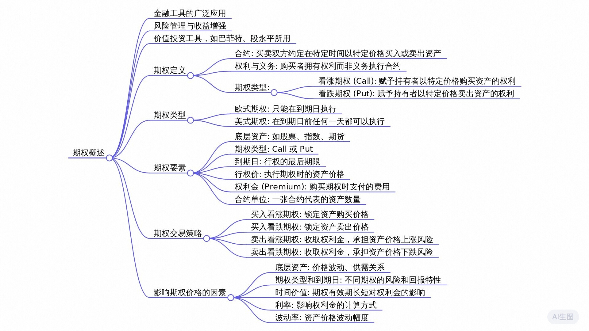

# 老虎期权训练营DAY1 学习笔记

## 2024年12月11日 

### 思维导图

发言人1   00:07
大家好，欢迎来到老虎机学小课堂。作为一种被广泛使用的金融工具，期权的市场价值早已在全世界范围内得到认可。巴菲特、段永平这样的价值投资大佬也喜欢交易期权，因为期权既是风险管理工具，也可以作为收益增强和价格发现的工具。用好期权这把利刃，让你赚钱的方式更加的丰富立体。那么期权到底是什么呢？现在就跟我学习，如果有个人，我们就叫他胖虎。

发言人1   00:35
胖虎跟你说，我允许你30天之内可以使用1200美元一股的价格跟我买100股特斯拉。前提是你现在就得给我100美元，如果到时候你不想买了，这100美元也不能退，你会怎么想？

发言人1   00:50
首先当然是查一下现在特斯拉的股价是多少，然后评估一下30天内特斯拉股价会不会超过1200美元。如果你觉得没问题，那你支付了100美元，你跟胖虎之间就成立了一个合约。这个合约就是期权合约。你父亲买了一项权利，胖虎收钱承担相应的义务。

发言人1   01:12
到这里我们就理解什么是期权了。七代表未来的一个时间期限权，代表权利。期权是买卖双方达成的一项合约，这张合约具体代表什么呢？期权的买卖双方约定好在未来的某个特定时间或是这个时间已约定好的价格买入或卖出某个资产。

发言人1   01:35
这个资产可以是股票，可以是指数，可以是期货。刚刚你从胖虎手里买的期权，叫看涨期权或认购期权，也就是靠为什么靠是看涨呢？因为当你行使权利的时候，你就从他的手里偷走了。股买入看涨期权，可以提前锁定价格去预购看好的资产。

发言人1   02:00
反过来，有一天泡沫跟你说，我最近看特斯拉涨得很高了，你要不这样给我100美元，30天内你可以随时以8万美元一股的价格卖给我100股特斯拉，你干不干呢？如果你很早就买了100股，特斯拉，成本在六百多，现在涨价到1000多了，你担心后续会暴跌，那很可能就干了。

发言人1   02:25
跟高相反，你买到的是把股票卖给对方的权利。所谓的破产，就叫做看跌期权或者认沽期权，也就是把你的股票破得到对方的桌上了。这个命名是不是很科学呢？前面说完期权的概念和类型，总结起来就是我们如果看好一项资产的走势，可以花一笔钱提前锁定它的买入价格，也就是买入扣。

发言人1   02:52
反正如果我们觉得资产价格会下行，也可以花一笔钱锁定卖出价格，也就是买入库存，到这里还都十分简单。问题出现了，胖虎为什么要卖给你？胖虎是谁？呀？其实就是跟你一样的，投资者直觉告诉我们，我们没法卖出自己没有的东西，但是期权却不是这样的。

发言人1   03:16
你可以买call买put也可以去卖，call my也称之为short call或者叫short post. 

发言人1   03:27
当你做期权卖方的时候，你的角色就跟前面的反过来，也就是胖虎的角色了。其实买方拥有权利，而你作为期权卖方也是要承担相应义务的。作为承担义务的代价，你可以收到来自买方付出的期权权利金。全明星跟行权价不是一回事，它更像是保费的概念。你收了保费，可以为别人提供保险义务。

发言人1   03:51
我们知道保险公司通常都是赚钱的，因为事故发生的概率都算入到保费里了，期权的定价也是如此。这也就是为什么专业的机构和投资者更愿意做期权的卖方了。在判断对的前提之下，贷方往往能够获得持续的收入。

发言人1   04:14
买卖和靠谱的组合一下，就是四种情形，觉得股票要大涨，以小博大的买高，觉得股票不会大涨。比如下跌震荡小涨的人，卖空赚钱，定金，觉得股票会大跌的人买破的也是以小博大。随着股票不会大跌，比如上涨，震荡，小跌的人卖货的准确率低。

发言人1   04:41
总结一下，这节课我们学习了数学的概念和用途，以及一个重要的点。我们可以作为期权的买方，也可以作为期权的卖方，买卖双方的权利义务。相反，对市场的判断也相反，这份全面的价格就是期权的定价，也就是权利金是不断变化的。你所听过的期权赚十倍百倍的故事，指的就是权利金翻十倍百倍。那么什么因素会影响期权权利金的价格和走势呢？

发言人1   05:11
首先第一个要素就是期权的底层资产。大家知道期权是个合约，所谓底层资产就是具体是关于什么东西的合约。你买特斯拉苹果的个股期权，那特斯拉苹果的股票就是对应期权的底层资产。

发言人1   05:26
期权走势跟正股表现紧密相连，底层资产除了股票以外，还包括指数、etf、期货等等。第二个要素是期权类型，就是call和put看涨和看跌期权。第三个要素是到期日，也是股票和期权最大的不同之一。

发言人1   05:46
股票你可以一直拿到天荒地老，期权却不行。过了约定时间就是废纸一张。那么期权是不是一定要到到期日才能行权呢？答案取决于期权类型是美式期权还是欧式期权。美式期权在到期日之前任意一天或当天都可以行权。欧式期权则必须在到期日当天才可以行权。我们平时交易的大多数股票期权属于美式期权，而指数期权通常指的是欧式期权。

发言人1   06:20
巴菲特就曾经卖出指数的长期看跌期权，为什么呢？就是因为指数的期权是欧式期权，他不用担心，因为短期的波动就被行权了。另外，美股标的大多有州权和跃权，港股标的一般只有越权。美国的越权是每个月第三周到期的期权。港股的月权一般是月底到期，相对来说美股标的的期权更多，流动性和成交量较大，其中知名公司的期权是大家主要交易的对象，比如特斯拉、苹果等。

发言人1   06:56
太远期货知名度更高的公司的稀缺，基本上没有什么流动性最好避开行权价和权利金，是新手容易混淆的两个概念。实际身价就约定买入或卖出的底层资产价格权。

发言人1   07:11
利金的概念也讲过，划重点期权买卖双方之间交易的不是股票，而是合约。每张合约都有自己独立的行情走势，它是基于底层资产衍生出来的，所以我们才叫它衍生品。

发言人1   07:27
一只股票期权合约可以有无数张，每张的权利金都是在变动中的第六个要素，合约单位就是一张合约对应的资产数量，每股期权一张合约约定155亿张，特斯拉期权合约对应100股特斯拉股票，港股期权对应关系不固定。比如，美团股票期权一张就对应500股。

发言人1   07:51
交易的时候要看清楚对应的数量，是，不然很可能一不小心就买多了。

发言人1   07:57
注意汽车行情里显示的权利金是一股的价格，如果你买卖一张或者说一手实际的成交金额是要一股价格乘以合约单位的每股期权就是乘以100千万。别以为自己要买100股的机器人，就在下单的时候输入了一个100，最后给大家来展示一下期权链。

发言人1   08:20
怎么看期权链有两种形式列表，报价和梯形报价，APP内可以设置那个报价，就是这样选不同的到期日，左滑就可以看到全部特定行程下的各类指标和价格上下滑，就可以看到不同行权价对应的合约。梯形报价是这样，上方切换到期日，中间是行权价，左右两边分别是call和put，他们的成交价，就是权利金。

发言人1   08:49
OK, 今天的课程我们总结了期权合约的六大要素，分别是底层资产、期权类型、到期日、行权价权利金和合约单位。我们也知道期权买方要付钱给卖方来获得期权，那么这个期权究竟值多少钱？为什么一只股票不同的期权费用差别那么大？

发言人1   09:12
下一节课我们接着聊。
