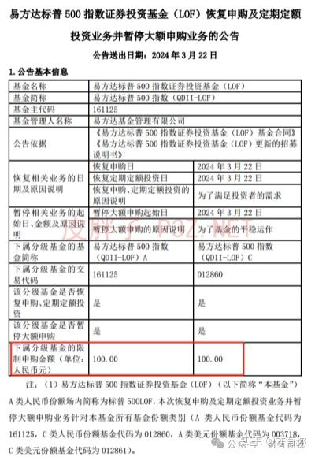
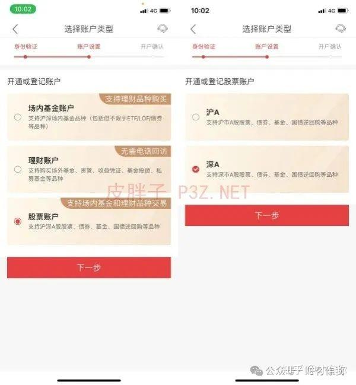
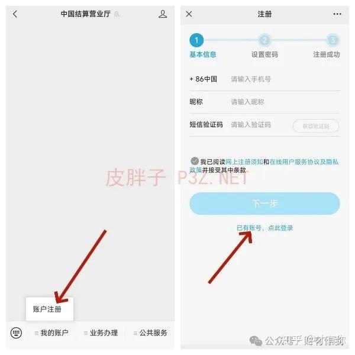
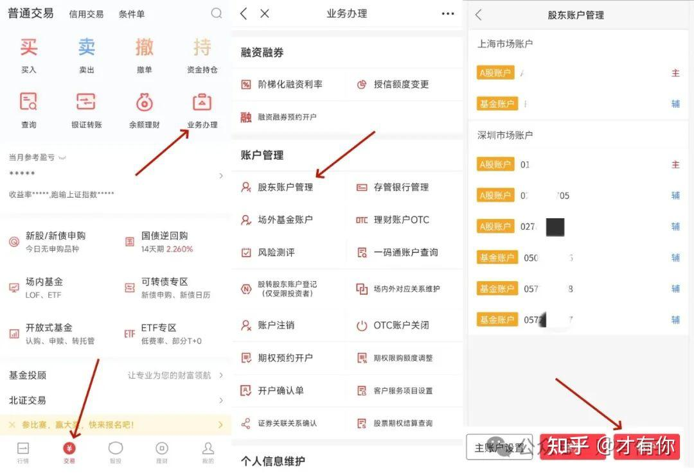
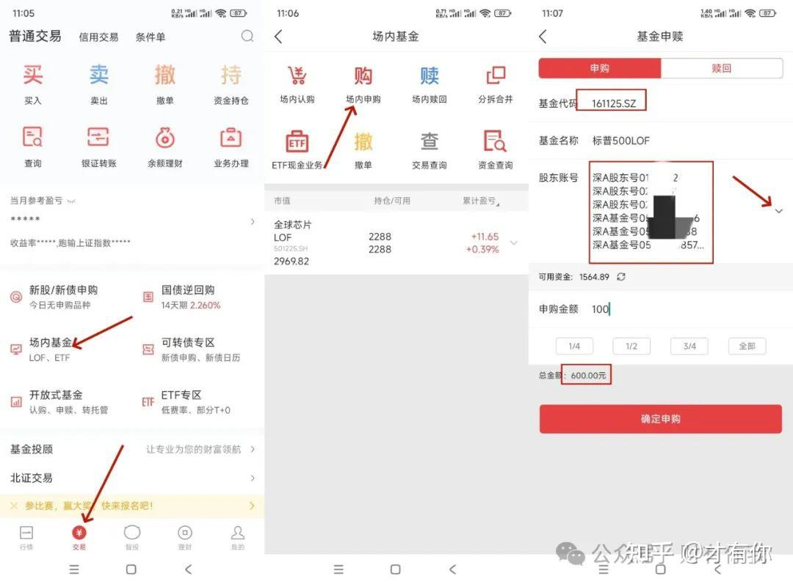

# 华宝证券一拖六拖拉机套利教程

[原文链接](https://zhuanlan.zhihu.com/p/688369034)

今天晚上标普500LOF（161125）基金一个公告引爆套利圈羊毛大军，明日起基金开放申购，申购金额最大100元，目前标普500LOF净值是2.2816元，场内价格是3.227元，溢价高达40%，而且他是深市基金，限额100元，这正是我们羊毛党要的，剩下的就是我们怎么尽最大可能的把这个羊毛吃到嘴里了，工具就是华宝证券一拖六拖拉机。

你也可以用其它券商，但是薅羊毛的券商要具备三个条件：

（1）券商支持场内基金申购费率一折；

（2）卖出LOF基金时免最低费率5元，也就是我们常说的免5；

（3）券商能够加挂3个深A股东账户和3个深基金股东账户；

满足以上3个条件明天就可以开始套利了，如果你还没有满足条件的券商，联系我们，一天帮你准备好华宝证券万1免5拖拉机账户，当天就可以开始套利了，下面我详细讲一下华宝证券如何实现一拖六拖拉机套利的，让你一分付出，六倍收益！

一、华宝证券开户
开万1免5的华宝需要通过我们专有的渠道，通过我们提供的开户二维码进行开户，扫码之后根据提示操作就可以开户了，按要求填写内容即可，地址要精确到门牌号，如果没有门牌号就随便编一个即可，这里提一下开户过程中需要注意的事项。

1、遇到下图选择开户类型的时候，我们选择“股票账户”，然后如果如果只是为了套利，只选深A就行，如果要炒股使用，最好沪A也选上。

2、风险等级要高一些

风险等级我们遵循一个原则，就是我学历高，有钱，有稳定的工作，不怕亏损，没有负担，按照这个标准去答题，一定没问题的，否则风险等级低的话后面套利比较麻烦。

二、查询有几个深市股东号
查询自己名下已经有几个深市股东号了，查询方式就是微信搜索并关注“中国结算营业厅”公众号，点击下面的“我的账户”，账户注册，如果你没有注册过就按照提示注册，注册过的话直接点击登录去登录就行了。

登录以后点击右上角的“已关联账户数/总账户数”，进去之后查看自己已经有几个“深市封闭式基金账户”和“深市A股账户”，正常一个人最多有3个“深市封闭式基金账户”和3个“深市A股账户”，把这个几个账户都记下来，如果你加起来已经有6个深市账户了，就直接看本文的第四章节，华宝加挂一拖六拖拉机教程，如果不够6个，就继续往下看如何开出来6个深市账户。

*中间部分内容略过了，是关于中泰开户的，感兴趣的去看原文吧*

四、华宝证券加挂一拖六拖拉机教程
如果你是按照我们的教程新开的华宝证券，那么你这时候应该只有一个深A账户，我们需要加挂2个深A张和3个深市封闭基金账户，华宝的加挂只能在下午4点前进行。

看下图，登录华宝证券之后，点击“交易”-“业务办理”-下拉找到“股东账户管理”-“转户”，把剩下的2个深A张和3个深市封闭基金账户选上，按照提示操作即可，现在是晚上，后面的步骤我没办操作，就不截图了，一会再查看股东账户管理的时候就会想我下图这样“深圳市场账户”显示有6个，这就算一拖六拖拉机加挂成功了。

五、LOF基金套利教程
明天开始标普500LOF可以申购了，我们就以这个基金为例演示一下怎么操作。

看下图，回到交易页面，点击“场内基金”-“场内申购”-基金代码输入我们要套利的161125，重点来了，股东账户下拉，全选上6个股东账户，由于每户限购额度是100，这时候我们申购金额填写100的时候下面的总申购额就变成了600元，可用资金充足的话确定申购，今天的工作就算完成了。

六、卖出LOF基金
有买有卖才算一个完整的套利过程，标普500LOF基金是T日下午3点前申购，T+2日到账，T+3日可卖，不含节假日，也就是明天3月22日申购的话，3月26日晚上基金份额到账，3月27日可卖，到时候如果溢价还在，有盈利，默认开盘市价直接卖出，然后循环进行申购操作，循环套利。

