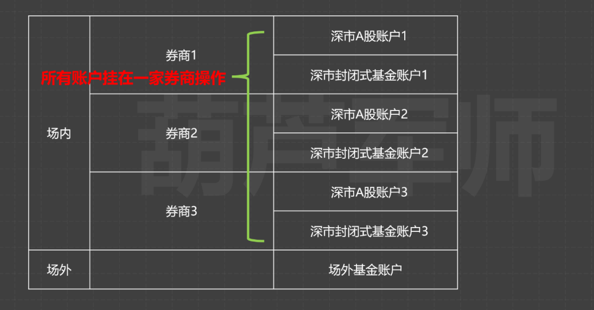

# 基金套利

利用部分基金限购（主要是海外QDII之类的外汇额度用完了）造成的场内溢价进行申购转场内交易获利的方法。

## 套利信息

*具体套利方法见后面章节*

- 2024/12/18

[今天有一大波套利机会，拖拉机全力出击！](https://mp.weixin.qq.com/s/lw34kOYNnKohcm34dx9rig)

只能场外申购的：

美元债LOF(501300)：溢价1.6%，限购100元，只能场外申购，不能拖拉机。

可以场内申购的有5只：

标普标普500LOF（161125）：溢价2%左右，限购100元，可以拖拉机

标普医疗保健LOF（161126）：溢价3%左右，限购100元，可以拖拉机

标普生物科技LOF（161127）：溢价1%左右，限购100元，可以拖拉机

纳斯达克100LOF（161130）：溢价2%左右，限购100元，可以拖拉机

美国消费LOF（162415）：溢价1%左右，限购100元，可以拖拉机

虽然看起来溢价不高，不过这种溢价水平才比较容易保持，并且也能吃肉，哪怕是苍蝇肉呢！

## 场外基金申购套利方法

[KIMI查询结果](https://metaso.cn/s/3yoE2kB)

场外基金申购套利的操作步骤如下：

1. **获取套利信息**：首先，需要在集思录等平台查看美元债LOF（501300）的溢价率，确保当前溢价率高于手续费成本。例如，当前溢价率为1.6%，则可以考虑进行套利操作。

2. **场外申购**：通过天天基金、支付宝或其他互联网销售平台（如理财通）进行场外申购。由于美元债LOF的场内申购起点金额为1000元，而限额仅为100元，因此无法直接场内申购，只能通过场外申购。

3. **建立场内外关系**：在券商APP上设置基金账户关系，确保沪深两市都建立关系。这一步骤非常重要，因为后续的转托管操作需要依赖于这种关系。

4. **转托管操作**：在场外申购后的T+3日进行转托管操作。具体步骤为登录券商APP，选择“开放式基金”中的“场外转场内”功能，输入可转份额并提交申请。通常情况下，T+2日即可在股票账户中看到转托管过来的份额。

5. **卖出套利**：转托管到账后，即可在T+2日通过场内卖出份额获利。需要注意的是，卖出时可能会产生交易佣金，通常不超过成交金额的千分之三。

6. **注意事项**：
   - 场外申购和转托管的操作可能因券商不同而有所差异，建议选择手续费较低的券商进行操作。
   - 转托管只能整数份额进行，不足整数部分会累计到下一笔一起转。
   - 场外申购到账后需要耐心等待T+3才能进行转托管操作，因此整个套利周期较长，大约需要5个交易日。

通过以上步骤，投资者可以利用美元债LOF（501300）的溢价率进行套利操作。需要注意的是，由于市场波动和手续费的存在，套利收益有限，投资者应谨慎操作，并关注市场风险。

## 场内基金申购套利方法

[KIMI查询结果](https://metaso.cn/s/rDoMNNC)

场内基金申购套利是一种利用LOF（上市型开放式基金）在场内和场外价格差异进行盈利的操作。具体操作步骤如下：

### 1. 开户与账户管理
首先，需要在华宝证券开设股票账户，并开通场内基金申购功能。根据证据，华宝证券支持一拖六拖拉机账户，即一个账户可以管理六个深市股东账户和六个深市基金账户。

### 2. 确认基金信息
选择可以进行套利的LOF基金，如标普500LOF（161125）、标普医疗保健LOF（161126）、标普生物科技LOF（161127）、纳斯达克100LOF（161130）和美国消费LOF（162415）。这些基金目前均处于溢价状态，适合进行套利操作。

### 3. 场内申购操作
- **登录华宝证券APP**：进入“场内基金”-“场内申购”页面。
- **输入基金代码**：例如输入标普500LOF的代码161125。
- **选择股东账户**：勾选所有可用的深市股东账户（最多六个），每个账户限购额度为100元。
- **填写申购金额**：每户限购100元，总申购金额为600元（假设六个账户）。
- **确认申购**：完成申购操作后，等待基金到账，通常需要3个交易日。

### 4. 场外转场内操作（可选）
如果使用场外申购，需先完成场外申购，然后办理转托管手续，将份额转入场内账户。此过程通常需要T+2到账。

### 5. 卖出基金
- **等待基金到账**：通常需要3个交易日。
- **卖出基金**：通过华宝证券的交易系统卖出基金，实现溢价套利。建议在溢价率较高时及时卖出，以避免市场波动带来的风险。

### 拖拉机账户操作
拖拉机账户是指在一个账户下管理多个股东账户，以提高申购额度。具体操作如下：
- **开通拖拉机账户**：在华宝证券APP中进行账户管理，选择股东账户管理，确保已开通一拖六功能。
- **加挂账户**：通过华宝智投APP增开或转户至华宝证券的深市股东账户和深市基金账户，确保账户数量达到六个。
- **批量申购**：在申购时选择所有可用的股东账户，一次性完成多个账户的申购操作。

### 注意事项
- **费率优惠**：选择支持场内申购费率一折的券商，以降低交易成本。
- **溢价率监控**：关注基金的溢价率变化，避免在溢价率下降或市场波动时套利失败。
- **风险控制**：承担3-5个交易日的价格波动风险，及时关注市场动态和净值变化。

通过以上步骤，投资者可以在华宝证券平台上高效地进行LOF基金的套利操作，并利用拖拉机账户提高申购额度，从而实现更高的收益。

## 葫芦军师的基金套利指南

[【超详细】基金套利挣零花钱操作指南](https://mp.weixin.qq.com/s/ZFMiy6YM8rUM05lmvUK9nQ)

*为防止文章链接失效，摘录如下：*

文稿正文如下：一个家庭3个人坚持做基金套利，2024年能挣1万块是真的么？什么是拖拉机账户？为什么一个人开超过3家券商是可行的？新手想做基金套利该如何上手？大家好，我是葫芦军师，你们的理财军师。军师在基金套利从入门到精通那期视频里，讲了5种基金套利的方法，其中有限购基金套利风险很小，能赚点零花钱，如果2024年一个家庭3个人坚持做基金套利，在标普信息科技LOF、印度基金LOF、美元债LOF三个基金上就能挣到接近1万元，而本金只需要1万多。没看过那期视频的建议先去看那期视频了解逻辑和原理，再来看实操指南。这种零花钱套利虽然风险最小，但是操作最繁琐，所以军师单独出了一期手把手的操作指南，包括如何监测溢价率数据？如何配齐7个套利账户？套利的具体操作？套利操作的费用？其中如何配齐7个套利账户是难点。

### 在哪看折价溢价情况？
 
 LOF基金有400多只，理论上都有出现溢价的可能性，但是零花钱套利需要找到持续溢价的LOF基金，能持续溢价的一定是限购的基金，而限购基金大部分都是QDII基金，所以我们日常可以在集思录QDII基金页面查看，点击溢价率可以按照溢价率进行排序。  

这些名称后缀是ETF跟普通人没啥关系，说下原因，比如这个纳斯达克科技ETF，点击景顺长城可以跳转这个ETF的官网页面，点击申购/赎回清单，

最小申购单位是100万份，净值1.4元，也就是最小申购门槛是140万元，每天净申购的基金份额上限是100万份，净申购就是申购减去赎回，但因为场内溢价，所以不会有人赎回，所以净申购上限100万份也就是申购上限100万份，结合最小申购单位，也就是每天只有一个人能申购成功。资金体量够的朋友可以去试着抢一抢，只要抢到1次然后场内溢价卖出，就能赚近10万。别的有溢价的ETF也都差不多，申购门槛至少100万元，一天最多有几个人能申购上。如果有在ETF套利成功过的大佬，可以在评论区分享一下经历和体验，让大家羡慕一下。说回正题，所以我们只看后缀是LOF的，以标普信息科技LOF为例，点击代码可以看到历史数据，过去几个月的溢价率高的时候能到10%以上。后面我们都以这个标普信息科技为例，强调一下，只是举例说明，不是推荐。   

这里解释一下这些数据的意思，现价就是场内交易的最新价格，盘中就是实时价格，盘后就是当天收盘价，盘前就是前一天的收盘价，涨幅就是当天的涨幅，成交是指当天的成交额，场内份额就是指场内有多少可交易的基金份额，场内申购和场外基金转托管到场内都会让这个份额增加，场内赎回会让这个份额减少；场内份额的净增长就是场内新增，当有溢价的时候场内新增基本上可以理解为套利盘的规模，这一天新增1000多万份，乘以4块多的净值，就是这一天新增了5000万的套利盘，这个基金总共才十几亿的盘子，估计要不了几天又得暂停申购。这里重点解释一下净值、估值、溢价率这几个概念。因为中国和美国有时差，美国比中国晚12个小时，所以溢价率这个数就很麻烦，我解释一下，非常饶，能听懂多少算多少，当中国是T-1日的白天盘中的时候，美国是T-2日的晚上；到了中国T-1日的晚上，这个基金要披露净值了，就是把基金持有的股票按照最新收盘价来算一下值多少钱，中国T-1日的晚上是美国T-1日的白天，美国股票正在交易，这个炒美股的人应该都知道，但是基金公司不能用美股盘中的数据来算净值，所以只能用T-2日股票收盘价来算净值，就是集思录这里这个T-2净值，这个是基金公司披露的，到了中国T日的盘中，其实T-1日美国的收盘价已经出来了，但是基金净值到了晚上才能算出来，所以这时候一般行情软件上显示的溢价率就是实时价格相对T-2净值的溢价率，但是集思录根据T-1这个基金跟踪指数的情况和T-1的人民币美元汇率情况，估算了一个T-1日的净值，也就是T-1估值，从而算出了T-1溢价率，这个溢价率是最及时的，军师核对过数据，发现这个估值溢价率准确性还可以，给集思录点赞。 

这个确实很绕，涉及到时差、净值计算时间等机制，网上讲套利的也没几个能把这个讲清楚的，军师也是研究了挺久才彻底搞明白的。如果你觉得太绕，懒得搞明白原理也可以，记住看集思录的数据是最准的就够了。军师跟集思录没有任何利益关系，纯粹是对优秀产品的欣赏，军师在没有找到集思录这个网站之前，找了很多APP和网站，都没有找到数据做的好的地方，都快烦死了，我当时都准备教大家如何自己估算最新基金净值了，所以找到集思录以后是非常激动的。至于这个需要付费的实时估值数据，应该是中国每天晚上基于美股指数的盘中数据算出来的，只有部分指数的ETF和LOF有这个实时溢价率，但是中国的晚上又不能做LOF的申赎和交易，所以军师认为做零花钱套利，看这个T-1的溢价率就够了。,

上面就是如何监测溢价率的方法。套利费用是在视频最后会讲，这里先给个结论，低费率券商一次正向套利费用不会超过套利本金的0.2%，所以军师觉得只要有1%以上的溢价率就值得做套利，你要是想保守些也可以设置到2%，不过是需要持续性溢价才可以，可以点击代码查看过去一段时间的数据。至于这些基金是否处于可申购状态，可以点击对应的基金公司看公告，最简单的方法是看有没有这个场内新增份额，有溢价又不为零的话就是可申购，如果现在不可申购，还可以在一些专业的基金销售平台设置提醒。比如这个印度基金现在就不可申购。可以在天天基金里找到这个基金，点击-开放提醒；如果你用的是支付宝，好像没有这个功能；另外军师常说的中欧财富APP里也有这个功能，基金页面点击开放提醒。    

这样这个基金一旦开放申购，你就能第一时间知道了，能及时知道基金开放申购非常重要，标普信息科技2024年截至10月总共开放了20多天，如果没有及时发现，那套利受益就大大下降了。

学会监测溢价率和申购状态以后，套机机会发现这个环节你就算掌握了。下面就是如何配置多个账户放大收益了。

### 如何配齐基金套利的7个账户？

配齐套利的7个账户，就是常说的拖拉机账户。

我们还是以标普信息科技这个基金为例，2024/10/25发的这个公告显示，每个基金账户只能申购300元。当时还有4%左右的溢价率，那么我们必然想尽可能的多搞基金账户来套利。       

这个LOF是在深交所上市的，可以场外申购和场内申购。

场内申购需要有证券账户。目前监管规定每个人最多能开3个证券账户，也就是平时我们说的最多能在三家证券公司（券商）开户，其实这种说法是不准确的。

一个完整的证券账户主要包括以下账号： 1个资金账户，也就是证券公司的客户号，就是你登录APP的那个账号。 

另外还有1个沪市A股账户，1个沪市封闭式基金账户，一个深市A股账户，1个深市封闭式基金账户，这4类账户都是登记在中国结算，也就是中证登，所谓的每个人最多开3个账户，指的是这4类账户每人最多能开3个。中国结算两个股东是上交所和深交所，虽然组织形式是公司，但是你粗略理解为是个半政府部门也没太大问题。 

这是中国结算官网的一个科普，证券公司（券商）其实只是开户代理机构，真正给你开户的是中国结算，你持有的股票、ETF之类的资产也是登记在中国结算的，所以军师之前在推荐开户的文章里写过，股票登记在中国结算、资金托管在银行，证券公司从机制上就不可能卷走你的股票和钱，是没有跑路风险的，有兴趣的朋友可以下载一个中国结算APP，这种垄断国企的APP不咋做宣传，知道的人很少，其实还挺好用

这里面可以看到自己所有的证券账户，包括已经注销的，以及跟证券公司的绑定情况，还能看到自己在所有证券公司持有的证券的情况，有不少人早就忘了自己开过哪些券商、甚至忘了自己还持有什么股票，这里面都能查到。之所以要讲这么细主要是为了大家更深入的理解拖拉机账户。    

这些账户的功能和特点我列在下面表格里了，A股账户就是用于交易和申赎股票、ETF、LOF等证券的，封闭式基金账户比股票账户少一个股票交易的功能，这里强调一下，封闭式基金账户只是叫这个名字，但并不是只能申赎和交易封闭式基金，所有LOF都可以，LOF里很多都是开放性的，400多只LOF基金里只有1/10是封闭式的。

这里军师做个小调查，讲操作指南的时候，军师喜欢先把原理讲清楚，包括前面溢价率、时差的东西和这里对证券账户的解释，但不可避免视频就会非常长，可能有些人就没耐心看完，大家是觉得现在这样更好，还是说简化些直接说操作和结论更好。做个投票吧。

说回正题，前面说标普信息科技一个基金账户只能申购300元，深市A股账户和深市封闭式基金各算1个基金账户。每人各能开3个券商，加起来就是6个账户，一个账户买300就是1800。之所以俗称拖拉机，是因为拖拉机一个机头可以拖好几个挂车，一个人就是一个机头，6个账户就是6个挂车。另外还能开一个场外基金账户，加上就是1拖7了，不过场外后面再说，先说场内。

场内1拖6账户配齐的具体操作还有点麻烦，需要分两步走。

第一步就是你找三家证券公司分别开户，正常的开户流程很简单，不需要我多废话，这里说下封闭式基金账户。一般封闭式基金不是默认开立，一般需要开户完成后再单独开一下封闭式基金，军师是开了银河、华泰、华宝三家，开出了六个账户。这里说下军师的用的几个券商的操作方法，别的券商也都类似。

先说银河证券，在银河证券APP的首页里点极速开户，点加挂户，输入账户密码（账户可以在我的-个人信息哪里复制），勾选上海和深圳两个封闭式基金账户，后面这个查询不要点，这个账户号码不要填，点下一步，然后就是正常的开户流程，上传身份证、视频验证之类的，一个工作日以后开户完成。 

华泰证券的涨乐财富通，先在搜索框里搜索证券账户组合开户，或者在业务办理那里点击证券账户组合开户，立即办理，输入手机和验证码后，选择新开证券账户，勾选两个封闭式基金账户，点击下一步。然后就是正常开户流程了。

其他券商也是类似的方法，不知道开可以问客户经理或者在智能客户那里提问：封闭式基金账户怎么开，一般都能查到，也有部分券商不支持线上开，比如东方财富证券只能线下到柜台办理。 

强调一下，我上面说的流程，都是在你正常开户完成以后，才能做的操作，如果你还没开户，现在有的券商在开户的时候就能勾选封闭式基金，就能一起开出来了，这个大家可以自行摸索。另外，这个视频的文稿军师也会发出来，方便大家查找。

三家券商开户完成后，深市和沪市的6个账户就都开好了。但也可能会出现一个问题，就是深交所的这些账户可能是重复的，比如深市A股账户1和深市A股账户2是同一个账户，那么深市的6个场内账户就可能会少几个，比如重复了1个，只开出来5个

我也不知道为什么，可能世界就是个草台班子吧，有知道原因的朋友可以评论区分享一下。不过沪市的账户只能指定一家证券公司使用，如果你开了三家就一定是6个账户。既然深市账户可以几家券商共用，那么其实你可以在很多家证券公司开户，不局限3个，只不过开第4个券商的时候只能开出深市账户，沪市账户开不出来。军师因为跟证券公司有合作，经常需要对比不同券商APP的功能，之前都是开一家就得销户一家，后来才发现原来不需要销户也能新开，所以军师开过的券商快10家了，现在还在用的也有4家。可以多家券商开户还有一个好处，就是可以在很多家证券公司薅新客理财的羊毛，虽然有点不道德。  

开完三家券商后6个沪市账户就配齐了，但是深市6个账户可能有重复，所以第二步就是对深交所账户差缺补漏，开齐6个账户。

这个差缺补漏的功能，华泰、华宝、银河做的比较好，下面我分别说一下。

先说华宝证券，套利是华宝的特色功能，他家也是最早把这块功能做好的券商。如果你选的三家券商包括华宝，第一步里给华宝开封闭式基金可以放在三家的最后，然后就可以和第二步查缺补漏合并为一步，操作流程如下

业务办理-股东账户管理-增开，先把上面两个点中，这是第一步里要做的事情，然后选择更多股东账户，把下面出来的所有的能打钩的都打钩了，有几个打几个，这是查缺补漏，如果下面没有出来新的可选的，说明你在另外两家券商开的深圳账户没有重复，然后点下一步，然后就是正常开户流程了。开户一般需要第二个工作日才能开出来，账户开出来以后。在交易-业务办理-股东账户管理那里选择转户    

这是为了把在其他两家券商开的账户加挂到华宝证券里，这个操作是为了可以在华宝一个APP里操作6个账户

如果不做转户，那么就需要每次套利都在三个券商APP里操作，比较麻烦，而且这个转户不会影响另外两家券商APP的使用，刚开始军师还担心别的券商不能用了，后来发现根本不影响，可以放心大胆转户。点击转户后系统会自动出来名下所有账户， 深圳A股和深证封闭式基金都点了，上海的都不要点，点了也没用，上海的转不过来，上海账户是跟另外两家券商绑定了。然后点击确定。全转过来以后再点股东账户管理，就是这样的了，上海2个，深圳6个，至此拖拉机组装完成，你的账号也就算是练成了。

*中间说的有点啰嗦，省略掉一部分哈~*

如果从零开始组装一个拖拉机，需要1周左右时间。之所以需要这么长时间，因为中间开户审批总需要等待，而且自动查询必须是交易时间，有时候忘了又得等一天，所以军师在讲基金套利的那个视频里就说，零花钱套利只适合那种空闲时间比较多的人。 

### 具体操作方法

下面我们说下套利的操作方法，看下我们费了老鼻子劲儿组装的拖拉机该怎么用。

还是以标普信息科技为例，再强调一下，仅为举例不是推荐。

在银河证券里，交易页面，点击场内基金，点击基金申购，输入基金代码，打开股东下拉箭头，这就是我们的拖拉机，点击全选，输入每天每个账户限购的金额300元，点击基金申购，申购完成。

军师第一次点击全选的时候，忽然就觉得前面组装拖拉机费的心血值了，甚至有点感动。我以前在基金公司的时候个人不能炒股，其实对很多交易规则没有那么熟，而且军师在组拖拉机的时候也没找到特别好的攻略，属于半看攻略半摸索，花了很多时间才把拖拉机完全搞清楚，大家如果对照着这期视频配置拖拉机，应该就不会出什么问题了，只是繁琐而已，可能也就不会有这种感动的感觉了。军师自诩这期视频是市面上最好的零花钱基金套利的操作指南，如果你认可军师的内容，千万不要吝啬点赞投币收藏，一键三连，没关注的点个关注，愿意的话可以再点一下设为特别关注，让军师能够获得正反馈。有问题的话可以在评论区留言，我都会看，也会把共性问题回复在置顶评论里，这期视频的文稿也会放在置顶评论里，方便大家对照着使用。  

申购完成后，因为标普信息科技是QDII基金，所以T+3日到账

基金到账以后，在持仓那里，选择基金点击卖出，进入场内交易页面之后，按照当前市场价，点击全仓卖出，不过卖的时候需要一个账户一个账户来卖，卖完一个需要在股东这里切换一下，依次把6个账户里的都卖掉。

至此，从申购到卖出一次完整的套利就结束了。在有溢价的期间里，每天都要重复申购和卖出这两个动作。

前面说的是场内申购的6个账户申购，其实标普信息科技还能在场外再申购一笔300元，场外基金账户同一个身份证不管在多少销售平台开过户都只算一个，比如你在支付宝、天天基金、中欧财富等平台都有基金账户，只算一个。场外基金账户申购成功以后，需要把份额转到场内才能交易，所以最好是在证券APP里申购场外基金，这样场外转场内简单点，否则就很麻烦。

这是银河的操作步骤，交易页面的理财交易专区，开放式基金（场外），基金购买，买入这个基金的A类人民币份额，买入300元，T+3日基金到账；在开放式基金（场外）那里选择基金场外转场内，输入转托管数量  

转托管还需要2天，也就是合计T+5能到场内账户可以卖出，所以场外基金套利一个周期需要5天。

*这里省略其他券商操作流程*

不管哪家券商时间都是一样的，QDII基金都是申购需要3天、转托管需要2天。

### 费用  

最后讲一下套利涉及的费用，这种零花钱基金套利每一笔挣得都不多，多则小几十块钱，少则几块钱，所以必须找费率便宜的券商。

如表，零花钱套利一般只涉及场内正向套利和场外正向套利，所以只涉及三个费用，场内申购的申购费、场内卖出的佣金、场外申购的申购费 

一般基金的申购费是1%左右，不过很多券商现在都能给到1折的优惠，也就是申购费是0.1%，场内场外申购都是。另外LOF卖出的佣金现在很多券商能做到万1以下，起步0.1元，1万块的交易额不到1块钱，军师常用的三个券商基本都是这个水平。零花钱套利一般一笔交易也就几百块钱，算下来几分钱，卖出佣金还不到起步价，所以就是0.1元。还是以标普信息科技为例，2024/11月一个账户一天限购300元，申购费0.1%就是0.3元，卖出佣金就是起步价0.1元，一次套利的费用也就是0.4元，是很便宜的，把套利费用除以本金300就是费用率0.13%。这样算下来理论上只要溢价率超过0.13%就值得套利。但如果是一个费率比较高的券商，比如申购费1%不打折，那申购费就是3元；LOF交易5元起，卖出佣金就是5元。加起来套利一次就要8块钱，溢价率超过3%才能覆盖交易成本，这样的话基金套利就是纯纯给券商打工了，所以零花钱套利必须是低费率券商，好在现在找个低费率券商并不太难。

如果你不知道你用的券商的费率是怎样的，可以去问一下客户经理   

如果想自己看的话，一般需要在查询那里去看交割单，然后看那个佣金然后除一下你的交易金额，自己算一下大概费率是多少

这些费率都是比较敏感的，所以券商的app里一般都很难查到，都需要自己算一下。

对于那种无限购基金的正向套利，申购费0.1%，卖出佣金我们按照万1计算，也就是0.01%，也就是理论上溢价超过0.11%就值得套利，实际中我觉得超过1%就很有价值了。

这里也顺便说一下反向套利的费用。这个费用就比较高了，场内买入费率还是按照万1（0.1元起步）计算，这个费用很少。主要是赎回费比较高，如果持有7天以内，赎回费一般高达1.5%，如果持有7天以上不到1年，一般赎回费也有0.5%。还是挺贵的，没有足够的折价是不值得反向套利的，定量的话，如果是那种无底仓套利，至少折价2%才值得套利。

从入门到精通那期视频，评论区有人说基金套利的成本是还包括基金管理费、托管费等，其实这个是有误区的，管理费、托管费都是按天计算的，每次套利的持有时间只有3天，一年1%的管理费分摊在3天里的是不到0.01%的，几乎可以忽略不计，而且这个费用已经反应在基金净值里了，并不是套利的额外费用。

最后要说一下，站在2024/11这个时点，这些QDII基金溢价很小，也就是当前时点是没有这种零花钱套利机会，也就是说这个实操指南有点像是一种屠龙之术，学会之后发现这个世界无龙可屠。不过就像军师在从入门到精通那期视频里说的，只要限购还存在，这种套利机会就一定会反复出现，正所谓机会都是留给有准备的人，只有提前做好准备，当机会来临时才能抓住。   

### 总结

下面做一下总结。

军师这期视频主要讲了零花钱基金套利的操作指南。核心包括如何发现溢价？如何组装拖拉机账户？套利如何具体操作？套利的费用？

发现溢价核心就是要用集思录，最常见的有限购LOF大部分都是QDII，QDII因为中美时差等原因溢价率比较滞后，集思录的估算溢价率时效性最强。遇到有溢价但暂停申购的，可以在基金销售平台上设置提醒，这样可以第一时间开始套利。

组装拖拉机账户是个很繁琐的工作，第一步需要在三家券商开户，开户后再把封闭式基金账户开了，但是深圳账户有可能会出现重复，所以还需要第二步查缺补漏，开齐6个账户，查缺补漏比较好用的券商是华宝、华泰和银河。

组好拖拉机，套利的实际操作比较简单，把深圳账户都挂到一家券商以后，可以一键6个账户一起申购，效率大大提升，申购到账后即可卖出。场外申购以后，还需要做场外基金转托管到场内才能卖出，一个流程比场内申购多2天的转托管时间。

套利的费用主要包括场内基金申购费、场外基金申购费、基金卖出佣金。一个账户一次零花钱套利赚钱就是几块到小几十块之间，如果是费率高的券商，一次套利交易费用就要几块钱，那就是给券商打工了，费率低的券商一次套利的费用只有小几毛钱，所以做套利一定要找优惠费率的券商。

